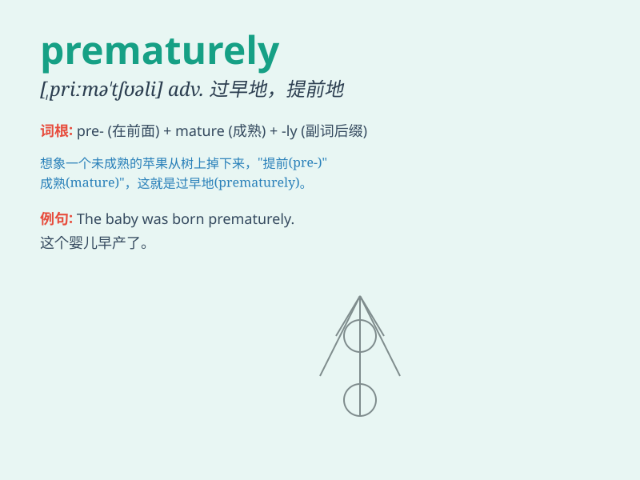

## prematurely

**英音:** _[\'premətʃəlɪ]_ **美音:** _[,primə\'tjʊrli]_

**译义:** *adv.过早地,早熟地*

### 短语

+ **prematurely born:** _早产的_

+ **prematurely gray:** _过早灰白的_

+ **prematurely end:** _过早结束_

+ **prematurely aged:** _过早衰老的_

+ **prematurely retired:** _提前退休的_

### 例句

#### 例句1

> **The baby was born prematurely and needed special care.**

**中文翻译:** 这个婴儿早产了，需要特殊护理。

**单词释义:** 过早地

#### 例句2

> **He prematurely ended the meeting without reaching a
conclusion.**

**中文翻译:** 他过早地结束了会议，没有得出结论。

**单词释义:** 过早地

#### 例句3

> **The flowers prematurely wilted due to the sudden cold
weather.**

**中文翻译:** 由于突然的寒冷天气，这些花过早地枯萎了。

**单词释义:** 过早地

### 背诵小故事

> A little bird tried to fly prematurely. It wasn\'t ready yet and
struggled in the air. But it learned that patience is important.
Prematurely means happening too soon or before the proper time.

**一只小鸟过早地尝试飞翔。它还没准备好，在空中挣扎。但它明白了耐心很重要。Prematurely
意思是过早地；提前地**

### 图义

