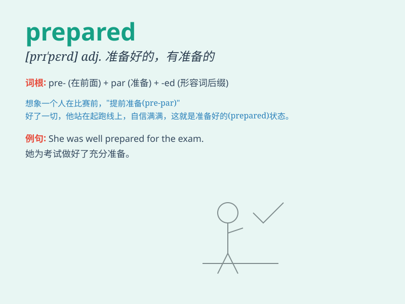

## prepared

**英音:** _[prɪˈpeəd]_ **美音:** _[prɪˈperd]_

**译义:** *adj.准备好的,精制的*

### 短语

+ **be prepared for:** _为\...做好准备_

+ **prepared statement:** _预编译语句；预处理语句_

+ **prepared food:** _预制食品；方便食品_

+ **well prepared:** _准备充分的；准备好的_

+ **prepared mind:** _有准备的头脑_

### 例句

#### 例句1

> **I\'m well prepared for the exam.**

**中文翻译:** 我为考试做好了充分的准备。

**单词释义:** 做好准备的

#### 例句2

> **The meal was prepared by my mother.**

**中文翻译:** 这顿饭是我妈妈准备的。

**单词释义:** 准备好的；预备的

#### 例句3

> **He was always prepared to help others.**

**中文翻译:** 他总是愿意帮助别人。

**单词释义:** 愿意；有准备的

### 背诵小故事

> A brave explorer was going on a dangerous journey. Before setting
off, he carefully packed his bag, checked his equipment and made a
detailed plan. He was well prepared and ready for any challenges ahead.

**一位勇敢的探险家要去进行一次危险的旅行。在出发前，他仔细地打包行李，检查装备并制定了详细的计划。他做好了充分的准备，随时准备迎接前方的任何挑战。**

### 图义

