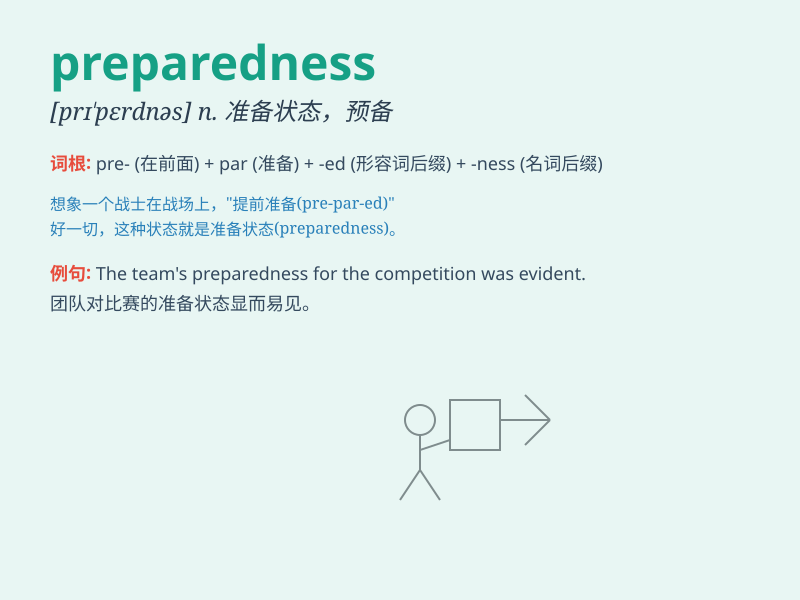

## preparedness

**英音:** _[prɪ\'peərɪdnɪs]_ **美音:** _[prɪ\'pɛrdnəs]_

**译义:** *n.有准备,已准备*

### 短语

+ **disaster preparedness:** _灾害防备_

+ **emergency preparedness:** _应急准备_

+ **preparedness plan:** _准备计划_

+ **preparedness measure:** _准备措施_

+ **preparedness training:** _准备训练_

### 例句

#### 例句1

> **The government\'s preparedness for natural disasters has been
questioned.**

**中文翻译:** 政府对自然灾害的防备工作受到了质疑。

**单词释义:** 防备；准备状态

#### 例句2

> **Our team\'s preparedness for the competition was evident in our
training.**

**中文翻译:** 我们团队为比赛所做的准备在训练中表现得很明显。

**单词释义:** 准备；预备

#### 例句3

> **The school\'s preparedness to handle emergencies ensures the
safety of students.**

**中文翻译:** 学校应对紧急情况的准备工作确保了学生的安全。

**单词释义:** 准备就绪

### 背诵小故事

> A soldier was always in a state of preparedness. Before each battle,
he checked his weapons and equipment. One day, when the enemy attacked
suddenly, his preparedness saved his life and his team. Preparedness
means being ready for something.

**一名士兵总是处于随时准备的状态。每次战斗前，他都会检查武器和装备。有一天，当敌人突然袭击时，他的充分准备救了他和他的团队。preparedness
意思是做好准备。**

### 图义

