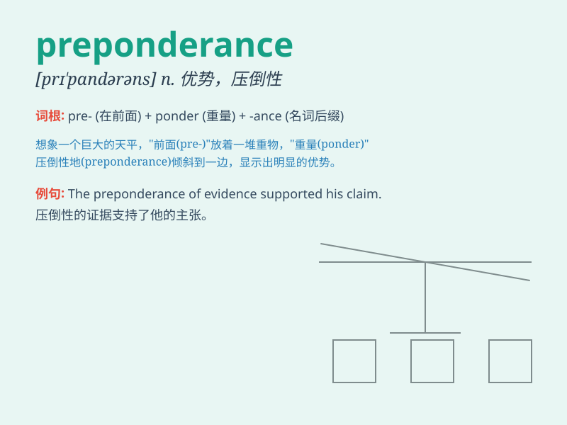

## preponderance

**英音:** _[prɪ\'pɒnd(ə)r(ə)ns]_ **美音:**
_[prɪ\'pɑndərəns]_

**译义:** *n.优势,占优势*

### 短语

+ **preponderance of evidence:** _优势证据_

+ **preponderance of power:** _权力优势_

+ **preponderance theory:** _优势理论_

+ **preponderance factor:** _优势因素_

+ **preponderance position:** _优势地位_

### 例句

#### 例句1

> **The preponderance of evidence pointed to his guilt.**

**中文翻译:** 大量的证据表明他有罪。

**单词释义:** 数量上的优势；多数；主导地位

#### 例句2

> **There is a preponderance of female students in the language
class.**

**中文翻译:** 语言课上女生占多数。

**单词释义:** （数量上的）优势；多数

#### 例句3

> **The preponderance of power lies with the government in this
situation.**

**中文翻译:** 在这种情况下，权力的主导地位在政府手中。

**单词释义:** 主导地位；优势

### 背诵小故事

> A king wanted to choose a successor. Among the candidates, one showed
a preponderance of wisdom and kindness. Eventually, he was chosen
because of this significant advantage. The word \'preponderance\' means
the majority or superiority.

**一位国王想要选择一位继承人。在候选人中，有一位展现出了明显的智慧和善良的优势。最终，因为这种显著的优势他被选中了。单词"preponderance"意思是多数；优势。**

### 图义

