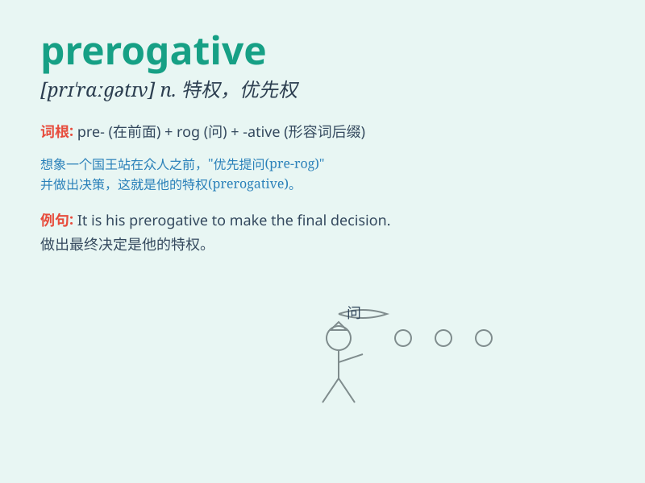

## prerogative

**英音:** _[prɪˈrɒɡətɪv]_ **美音:** _[prɪˈrɑːɡətɪv]_

**译义:** *n.特权*

### 短语

+ **prerogative power:** _特权权力_

+ **prerogative of mercy:** _赦免特权_

+ **royal prerogative:** _王室特权_

+ **executive prerogative:** _行政特权_

+ **constitutional prerogative:** _宪法特权_

### 例句

#### 例句1

> **It is the prerogative of the president to make important
decisions.**

**中文翻译:** 做出重要决定是总统的特权。

**单词释义:** 特权；优先权

#### 例句2

> **Deciding who gets promoted is the prerogative of the management
team.**

**中文翻译:** 决定谁获得晋升是管理团队的特权。

**单词释义:** 特权；优先权

#### 例句3

> **The choice of which book to read first is your prerogative.**

**中文翻译:** 首先读哪本书的选择是你的特权。

**单词释义:** 特权；自行决定权

### 背诵小故事

> The king had the prerogative to decide the fate of his subjects. One
day, a poor farmer was accused of stealing. But the king used his
prerogative and found the farmer was innocent. Thus, the prerogative was
not always used wrongly.

**国王拥有决定其臣民命运的特权。有一天，一个贫穷的农民被指控偷窃。但国王运用他的特权，发现农民是无辜的。因此，特权并不总是被错误地使用。**

### 图义

