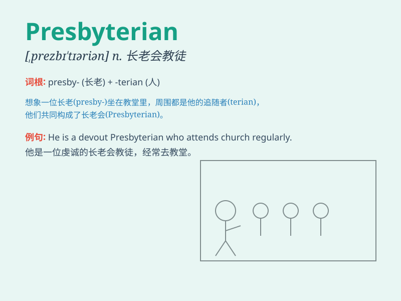

## Presbyterian

**英音:** _[presˈbɪtərɪən]_ **美音:** _[presˈbɪtərɪən]_

**译义:** *n.长老会教友；长老制信徒 adj.长老会的；长老制的*

### 短语

+ **Presbyterian Church:** _长老会教堂_

+ **Presbyterian minister:** _长老会牧师_

+ **Presbyterian doctrine:** _长老会教义_

+ **Presbyterian belief:** _长老会信仰_

+ **Presbyterian system:** _长老会制度_

### 例句

#### 例句1

> **The Presbyterian church holds its services every Sunday.**

**中文翻译:** 长老会教堂每周日举行礼拜仪式。

**单词释义:** 长老会的

#### 例句2

> **She is a devout Presbyterian.**

**中文翻译:** 她是一位虔诚的长老会教徒。

**单词释义:** 长老会的；长老会教徒

#### 例句3

> **The Presbyterian minister delivered a powerful sermon.**

**中文翻译:** 这位长老会牧师发表了一篇有力的布道。

**单词释义:** 长老会的

### 背诵小故事

>
想象一个长老（presbyter）在教堂里严肃地主持会议，他的形象代表着Presbyterian这个词所描述的长老会教派。大家都尊重他的权威和智慧。

**想象一位长老在教堂主持会议来辅助记忆Presbyterian（长老会教派）这个单词**

### 图义

