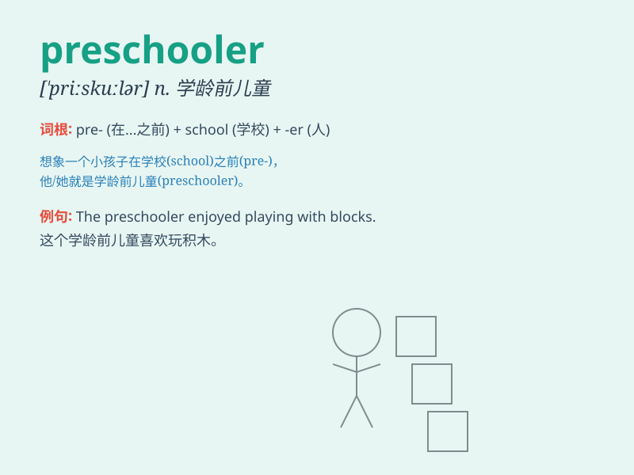

## preschooler

**英音:** _[ˈpriːskuːlə(r)]_ **美音:** _[ˈpriːskuːlər]_

**译义:** *n.学龄前儿童*

### 短语

+ **preschooler education:** _学前儿童教育_

+ **typical preschooler:** _典型的学前儿童_

+ **preschooler activities:** _学前儿童活动_

+ **busy preschooler:** _忙碌的学前儿童_

+ **curious preschooler:** _好奇的学前儿童_

### 例句

#### 例句1

> **The preschooler was excited to start her first day at the
preschool.**

**中文翻译:** 这个学龄前儿童很兴奋能开始她在学前班的第一天。

**单词释义:** 学龄前儿童

#### 例句2

> **The preschooler showed great curiosity about the new toys.**

**中文翻译:** 这个学龄前儿童对新玩具表现出极大的好奇心。

**单词释义:** 学龄前儿童

#### 例句3

> **The teacher was patient with the little preschooler who was
having trouble tying his shoes.**

**中文翻译:** 老师对那个系鞋带遇到困难的小学龄前儿童很有耐心。

**单词释义:** 学龄前儿童

### 背诵小故事

> A little preschooler named Lily was excited to go to her preschool
every day. She played with toys, learned new songs, and made friends.
Lily loved being a preschooler and having so much fun.

**一个叫莉莉的学龄前儿童每天都很兴奋地去她的学前班。她玩玩具，学新歌，还交了朋友。莉莉喜欢当学龄前儿童，过得非常开心。**

### 图义

