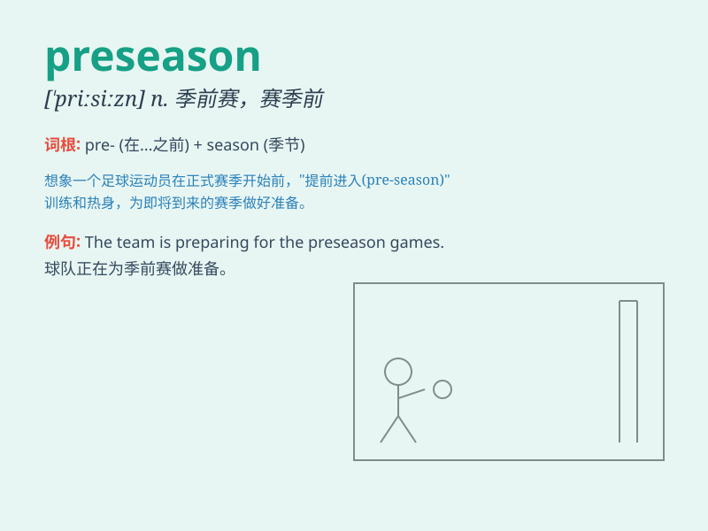

## preseason

**英音:** _[priː\'siːzn]_ **美音:** _[priː\'siːzən]_

**译义:** *adj.活跃季节前的,旺季前的*

### 短语

+ **preseason training:** _季前训练_

+ **preseason game:** _季前赛_

+ **preseason warm-up:** _季前热身_

+ **preseason form:** _季前状态_

+ **preseason preparation:** _季前准备_

### 例句

#### 例句1

> **The football team is in intense preseason training.**

**中文翻译:** 这支足球队正在进行紧张的季前训练。

**单词释义:** 季前的

#### 例句2

> **The preseason games give the coach a chance to evaluate new
players.**

**中文翻译:** 季前赛给教练提供了评估新球员的机会。

**单词释义:** 季前的

#### 例句3

> **She performed well in the preseason competition.**

**中文翻译:** 她在季前赛中表现出色。

**单词释义:** 季前的

### 背诵小故事

> In the preseason of the football league, the team trained hard every
day. The players knew that this was their chance to prepare well for the
upcoming challenging matches. \'Preseason\' means the period before the
main season starts.

**在足球联赛的季前赛期间，球队每天都刻苦训练。球员们知道这是他们为即将到来的具有挑战性的比赛做好准备的机会。'preseason'意思是主要赛季开始之前的时期。**

### 图义

