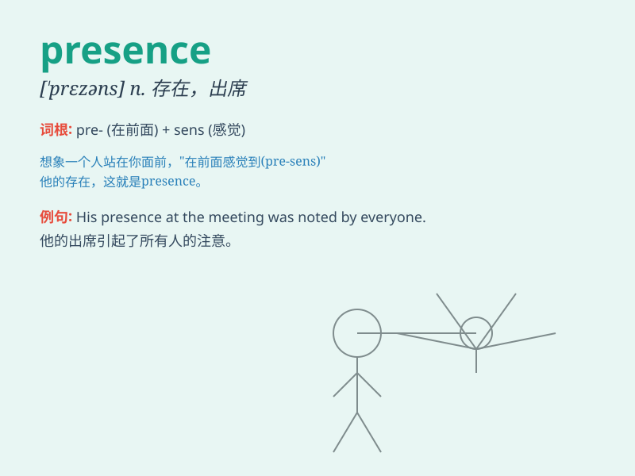

## presence

**英音:** _[\'prez(ə)ns]_ **美音:** _[\'prɛzns]_

**译义:** *n.出席,到场,存在*

### 短语

+ **in the presence of:** _在...面前；有...在场_

+ **presence of mind:** _镇定，沉着_

+ **make one\'s presence felt:** _表现突出；产生影响_

+ **sense of presence:** _临场感；存在感_

+ **physical presence:** _实体存在；实际存在_

### 例句

#### 例句1

> **His presence at the meeting was unexpected.**

**中文翻译:** 他出席会议出乎大家的意料。

**单词释义:** 出席；到场

#### 例句2

> **The presence of her mother gave her comfort.**

**中文翻译:** 她母亲的在场给了她安慰。

**单词释义:** 在场；存在

#### 例句3

> **The actor has a commanding presence on the stage.**

**中文翻译:** 这位演员在舞台上有强大的气场。

**单词释义:** 气场；风度

### 背诵小故事

> A king was always worried about his presence in people\'s hearts. One
day, a wise man told him that true presence is felt through kindness and
justice. The king changed and his presence became a symbol of hope.

**一位国王总是担心他在人民心中的存在。有一天，一位智者告诉他，真正的存在是通过善良和正义被感受到的。国王改变了，他的存在成为了希望的象征。**

### 图义

