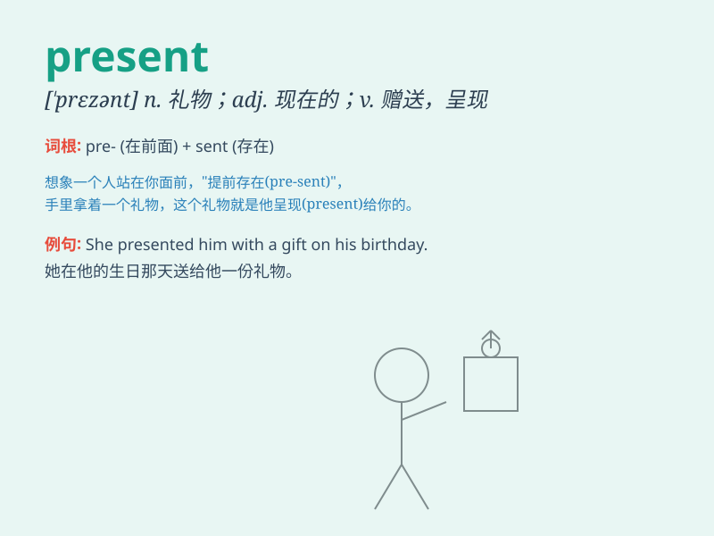

## present

**英音:** _[prɪˈzent;(for n.)ˈpreznt]_ **美音:**
_[prɪˈzɛnt;(for n.)ˈprɛznt]_

**译义:**
*n.赠品,礼物,现在,瞄准adj.现在的,出席的,当面的vt.介绍,引见,给,赠送,上演,提出,呈现vi.举枪瞄准*

### 短语

+ **present situation:** _现状_

+ **present company:** _在座诸位_

+ **present oneself:** _出席；到场_

+ **at present:** _目前；现在_

+ **for the present:** _暂时；暂且_

### 例句

#### 例句1

> **I received a present on my birthday.**

**中文翻译:** 我在生日那天收到了一份礼物。

**单词释义:** 礼物

#### 例句2

> **The present situation is very difficult.**

**中文翻译:** 目前的形势非常困难。

**单词释义:** 目前的；现在的

#### 例句3

> **She presented her report to the committee.**

**中文翻译:** 她向委员会提交了她的报告。

**单词释义:** 提交；呈现

### 背诵小故事

>
想象一下，生日派对上，朋友把一个精美的礼物盒递到你面前（present），说这是专门为你准备的。此刻，这个礼物就是'礼物；现在的；出席的'的代表，是不是一下就记住
present 啦？

**想象在生日派对上，朋友把礼物递到你面前来帮助记住 present
这个单词，意思是礼物、现在的、出席的**

### 图义

