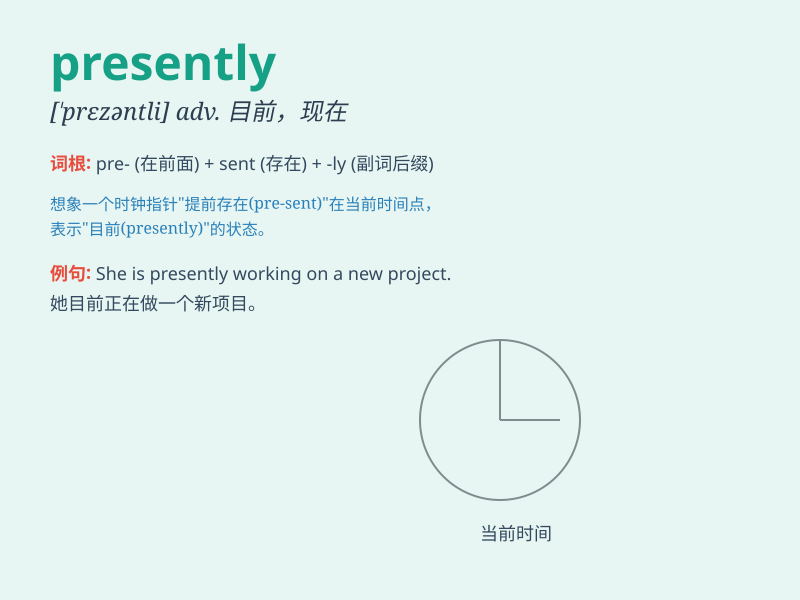

## presently

**英音:** _[\'prez(ə)ntlɪ]_ **美音:** _[\'prɛzntli]_

**译义:** *adv.目前,不久*

### 短语

+ **presently available:** _目前可用的_

+ **presently employed:** _目前受雇的_

+ **presently living:** _目前居住_

+ **presently happening:** _正在发生_

+ **presently engaged:** _目前从事_

### 例句

#### 例句1

> **Presently, the door opened and a man walked in.**

**中文翻译:** 不久，门开了，一个男人走了进来。

**单词释义:** 不久；马上

#### 例句2

> **He is presently working on a new novel.**

**中文翻译:** 他目前正在写一部新小说。

**单词释义:** 目前；当下

#### 例句3

> **The doctor will see you presently.**

**中文翻译:** 医生马上就来给你看病。

**单词释义:** 马上；立刻

### 背诵小故事

> A man was lost in a forest. Presently, a kind fairy appeared and
guided him out. \'Presently\' here means very soon or shortly. It was as
if the help came in no time.

**一个男人在森林里迷路了。不久，一个善良的仙女出现并引导他走了出去。"presently"在这里表示很快或不久。就好像帮助瞬间就来了。**

### 图义

