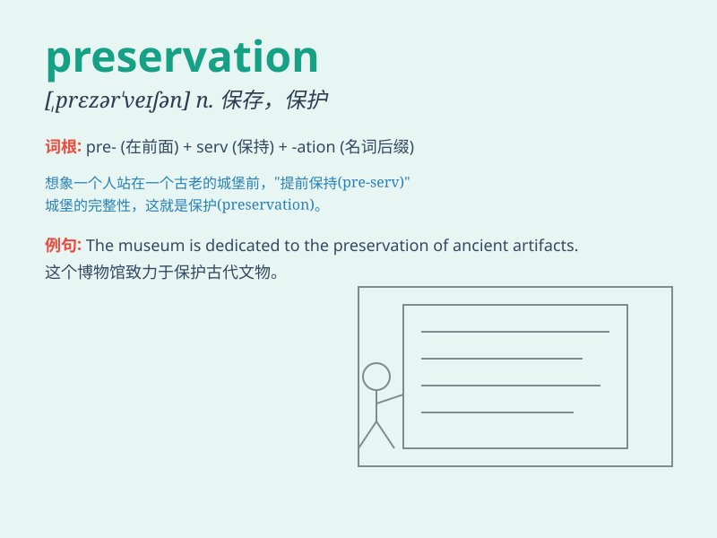

## preservation

**英音:** _[prezə\'veɪʃ(ə)n]_ **美音:**
_[,prɛzɚ\'veʃən]_

**译义:** *n.保存*

### 短语

+ **preservation of wildlife:** _野生动物的保护_

+ **preservation of historical buildings:** _历史建筑的保存_

+ **preservation of cultural heritage:** _文化遗产的保护_

+ **food preservation:** _食物保存_

+ **preservation measures:** _保护措施_

### 例句

#### 例句1

> **The preservation of historical buildings is of great
importance.**

**中文翻译:** 历史建筑的保存非常重要。

**单词释义:** 保存；保护

#### 例句2

> **Food preservation techniques have improved over the years.**

**中文翻译:** 这些年来食品保存技术已经提高了。

**单词释义:** 保存；保鲜

#### 例句3

> **The national park is dedicated to the preservation of
wildlife.**

**中文翻译:** 这个国家公园致力于野生动物的保护。

**单词释义:** 保护

### 背诵小故事

> A group of scientists were working hard on a project for the
preservation of ancient artifacts. They protected and maintained these
precious items to keep history alive. Remember, preservation means to
protect and keep something in its original state.

**一群科学家正在为保护古代文物的一个项目努力工作。他们保护并维护这些珍贵的物品以留存历史。记住，preservation
意思是保护并维持某物的原状。**

### 图义

