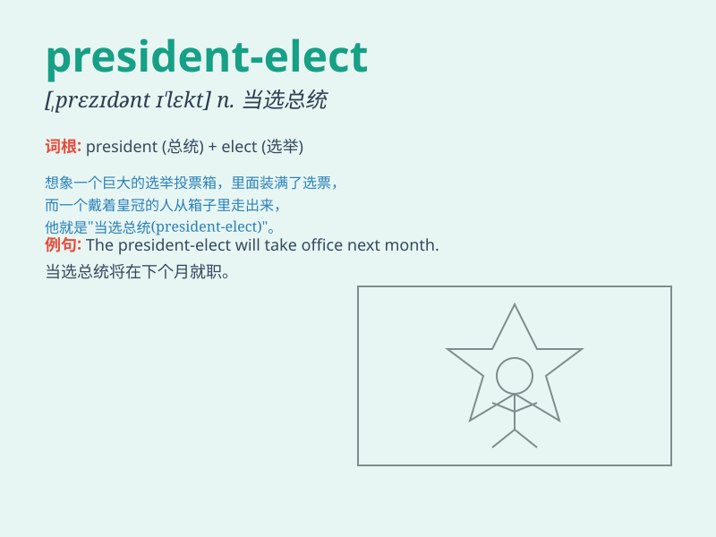

## president-elect

**英音:** _[prezɪd(ə)ntˈɪlekt]_ **美音:**
_[prezɪdəntˈɪlekt]_

**译义:** *n.当选总统，候任总统（指已当选但尚未就职的美国总统）*

### 短语

+ **president-elect\'s speech:** _当选总统的演讲_

+ **president-elect\'s team:** _当选总统的团队_

+ **president-elect\'s policy:** _当选总统的政策_

+ **president-elect\'s transition:** _当选总统的过渡时期_

+ **president-elect\'s agenda:** _当选总统的议程_

### 例句

#### 例句1

> **The president-elect delivered a powerful speech.**

**中文翻译:** 这位当选总统发表了一次有力的演讲。

**单词释义:** 当选总统

#### 例句2

> **The president-elect is busy forming a new cabinet.**

**中文翻译:** 当选总统正忙于组建新内阁。

**单词释义:** 当选总统

#### 例句3

> **The public has high expectations for the president-elect.**

**中文翻译:** 公众对当选总统寄予厚望。

**单词释义:** 当选总统

### 背诵小故事

> 想象一下，有一场盛大的选举，最终胜出的那个人还未正式上任，这个人就是
president-elect。就像小明在竞选成功后，等待就职的那段时间，他就是
president-elect，大家都期待着他正式履行职责。

**（尚未就职的）当选总统（或国家主席等）**

### 图义

