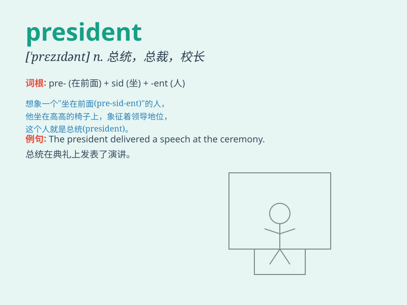

## president

**英音:** _[\'prezɪd(ə)nt]_ **美音:** _[\'prɛzɪdənt]_

**译义:** *n.总统,会长,校长,行长*

### 短语

+ **vice president:** _副总统；副主席_

+ **former president:** _前任总统_

+ **president elect:** _当选总统（尚未就职的）_

+ **company president:** _公司总裁_

+ **president office:** _总统办公室_

### 例句

#### 例句1

> **The president of the company delivered an inspiring speech at the
annual meeting.**

**中文翻译:** 公司的总裁在年会上发表了鼓舞人心的演讲。

**单词释义:** 总裁

#### 例句2

> **The president of the United States visited several countries last
month.**

**中文翻译:** 美国总统上个月访问了几个国家。

**单词释义:** 总统

#### 例句3

> **He was elected as the president of the student union.**

**中文翻译:** 他被选为学生会主席。

**单词释义:** 主席

### 背诵小故事

>
想象一个国家正在举行盛大的仪式，人们都在等待着重要人物的出现。终于，总统（president）出现了，他面带微笑，挥手向大家致意，因为他是这个国家的最高领导者，肩负着重大责任。

**想象一个国家举行仪式，人们等待总统出现，他是最高领导者，面带微笑挥手，肩负重大责任。**

### 图义

