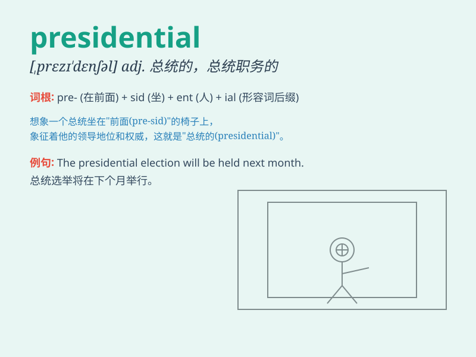

## presidential

**英音:** _[,prezɪ\'denʃəl]_ **美音:** _[\'prɛzədɛnʃəl]_

**译义:** *adj.总统的*

### 短语

+ **presidential election:** _总统选举_

+ **presidential candidate:** _总统候选人_

+ **presidential palace:** _总统府_

+ **presidential term:** _总统任期_

+ **presidential suite:** _总统套房_

### 例句

#### 例句1

> **The presidential election is coming soon.**

**中文翻译:** 总统选举很快就要来了。

**单词释义:** 总统的；与总统有关的

#### 例句2

> **She gave a presidential address at the conference.**

**中文翻译:** 她在会议上发表了总统式的讲话。

**单词释义:** 总统的；与总统有关的

#### 例句3

> **The presidential suite in the hotel is very luxurious.**

**中文翻译:** 这家酒店的总统套房非常豪华。

**单词释义:** 总统的；与总统有关的

### 背诵小故事

> A young man dreams of becoming presidential. He works hard, gives
inspiring speeches, and finally achieves his goal. His presidential
journey is full of challenges but also great achievements.

**一个年轻人梦想成为总统。他努力工作，发表鼓舞人心的演讲，最终实现了目标。他的总统之旅充满挑战，但也取得了巨大成就。**

### 图义

