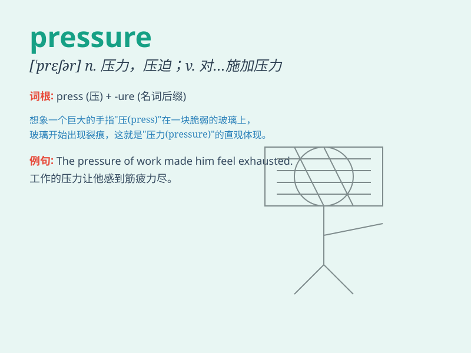

## pressure

**英音:** _[\'preʃə]_ **美音:** _[\'prɛʃɚ]_

**译义:** *n.压,压力,电压,压迫,强制,紧迫*

### 短语

+ **under pressure:** _在压力下；受到压力_

+ **blood pressure:** _血压_

+ **high pressure:** _高压；高气压；高度紧张_

+ **pressure cooker:** _高压锅；压力 cooker_

+ **put pressure on:** _对\...\...施加压力_

### 例句

#### 例句1

> **The pressure of the exam is too high for many students.**

**中文翻译:** 对于许多学生来说，考试的压力太大了。

**单词释义:** 压力

#### 例句2

> **He felt the pressure to succeed in his new job.**

**中文翻译:** 他感到在新工作中取得成功的压力。

**单词释义:** 压力

#### 例句3

> **The pressure of the gas in the container is increasing.**

**中文翻译:** 容器里气体的压力在增加。

**单词释义:** 压力；压强

### 背诵小故事

> One day, a little balloon was filled with too much gas. It felt a
huge pressure inside and was about to burst. Just then, the gas was
released, and the pressure vanished. The balloon was relieved.

**有一天，一个小气球被充入了太多的气体。它感到内部有巨大的压力，几乎要爆开了。就在这时，气体被释放，压力消失了。气球松了一口气。**

### 图义

