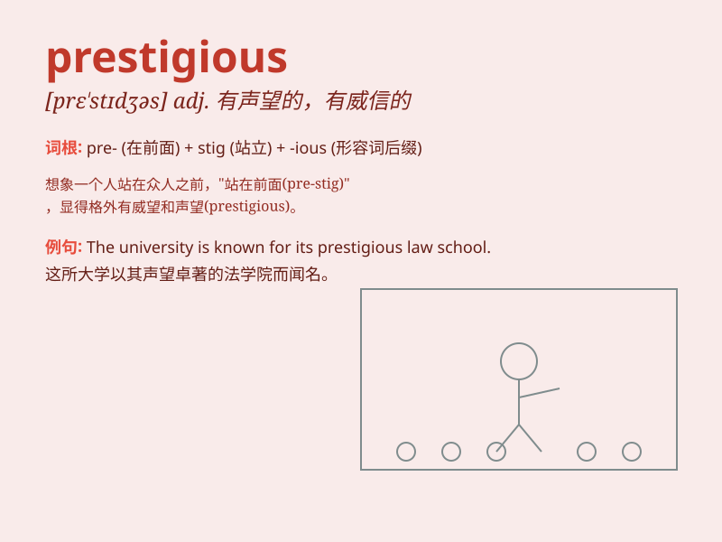

## prestigious

**英音:** _[pre\'stɪdʒəs]_ **美音:** _[prɛ\'stɪdʒəs]_

**译义:** *adj.享有声望的,声望很高的*

### 短语

+ **prestigious university:** _著名的大学_

+ **prestigious award:** _有声望的奖项_

+ **prestigious firm:** _有名望的公司_

+ **prestigious position:** _令人敬仰的职位_

+ **prestigious event:** _有威望的活动_

### 例句

#### 例句1

> **She graduated from a prestigious university.**

**中文翻译:** 她毕业于一所著名的大学。

**单词释义:** 享有声望的，有名望的

#### 例句2

> **The company holds a prestigious position in the industry.**

**中文翻译:** 这家公司在行业中占据着显赫的地位。

**单词释义:** 有声望的，有威望的

#### 例句3

> **He received a prestigious award for his scientific research.**

**中文翻译:** 他因其科学研究获得了一项享有盛誉的奖项。

**单词释义:** 有声誉的，受尊敬的

### 背诵小故事

> A young artist dreamed of entering a prestigious art academy. Despite
many difficulties, she worked hard and finally got in. The academy\'s
name carried great honor and respect. \'Prestigious\' means having high
status and being respected.

**一位年轻的艺术家梦想进入一所享有盛誉的艺术学院。尽管面临诸多困难，她努力拼搏，最终得以入学。这所学院的名声带来了极大的荣誉和尊重。'prestigious'意思是有很高的地位并且受尊重的。**

### 图义

