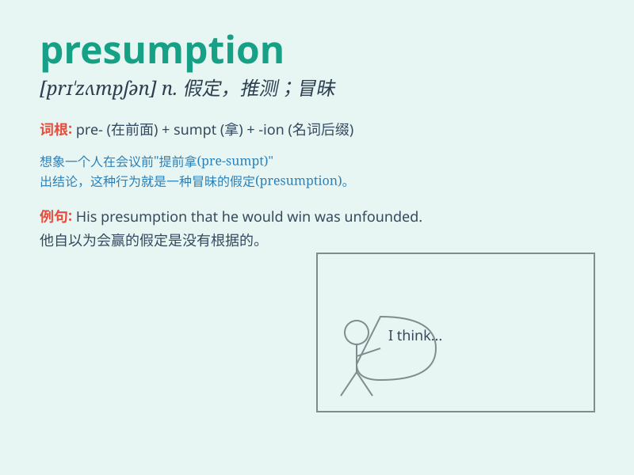

## presumption

**英音:** _[prɪ\'zʌm(p)ʃ(ə)n]_ **美音:**
_[pri\'zʌmpʃən]_

**译义:** *n.假定*

### 短语

+ **presumption of innocence:** _无罪推定_

+ **on the presumption that:** _基于\...\...的假设_

+ **reasonable presumption:** _合理推定_

+ **unwarranted presumption:** _无根据的假定_

+ **presumption of fact:** _事实推定_

### 例句

#### 例句1

> **The presumption of innocence is a fundamental principle of
law.**

**中文翻译:** 无罪推定是法律的一项基本原则。

**单词释义:** 假定；假设

#### 例句2

> **His presumption that he would win the game proved wrong.**

**中文翻译:** 他认为自己会赢得比赛的假定被证明是错误的。

**单词释义:** 假定；推测

#### 例句3

> **I don\'t like his presumption in making such a decision without
consulting us.**

**中文翻译:** 我不喜欢他在没有咨询我们的情况下就做出这样决定的专横。

**单词释义:** 放肆；专横

### 背诵小故事

> A detective was solving a case. Everyone had a presumption that the
rich man was the criminal. But the detective didn\'t jump to
conclusions. He investigated carefully and finally found the real
culprit. Remember, presumption can lead us astray.

**一位侦探在破案。每个人都假定那个富人是罪犯。但侦探没有妄下结论。他仔细调查，最终找到了真凶。记住，假定可能会让我们误入歧途。**

### 图义

