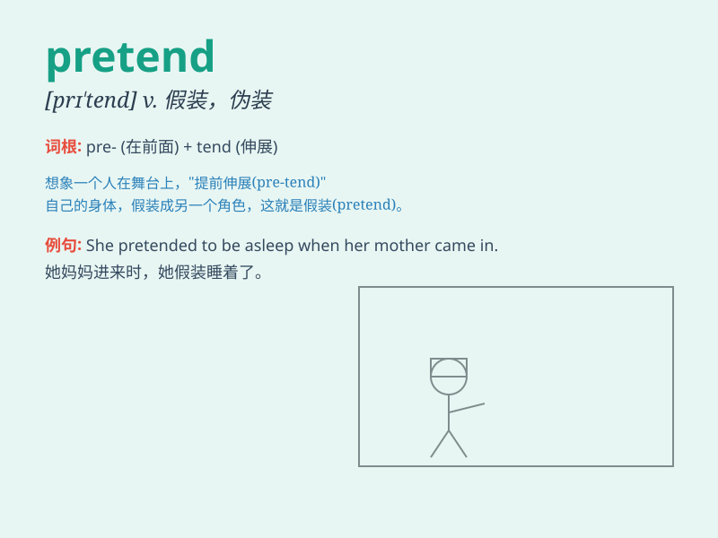

## pretend

**英音:** _[prɪ\'tend]_ **美音:** _[prɪ\'tɛnd]_

**译义:** *vt.假装,装扮,(作为藉口或理由)伪称*

### 短语

+ **pretend to do sth:** _假装做某事_

+ **pretend to be:** _假装是_

+ **pretend that:** _假装\...\..._

+ **pretend ignorance:** _装作不知情_

+ **pretend sleep:** _假装睡觉_

### 例句

#### 例句1

> **The children pretended to be pirates.**

**中文翻译:** 孩子们假装是海盗。

**单词释义:** 假装

#### 例句2

> **She pretended not to hear me.**

**中文翻译:** 她假装没听见我说话。

**单词释义:** 假装

#### 例句3

> **He pretended to be asleep when I came in.**

**中文翻译:** 我进来时，他假装睡着了。

**单词释义:** 假装

### 背诵小故事

> One day, a little boy saw a big cake and pretended to be a chef. He
made funny gestures and said, \'I\'m the best chef!\' But in fact, he
didn\'t know how to cook. He just pretended for fun.

**一天，一个小男孩看到一个大蛋糕，假装自己是个厨师。他做出滑稽的手势说：'我是最棒的厨师！'但实际上，他根本不会做饭。他只是为了好玩而假装。**

### 图义

