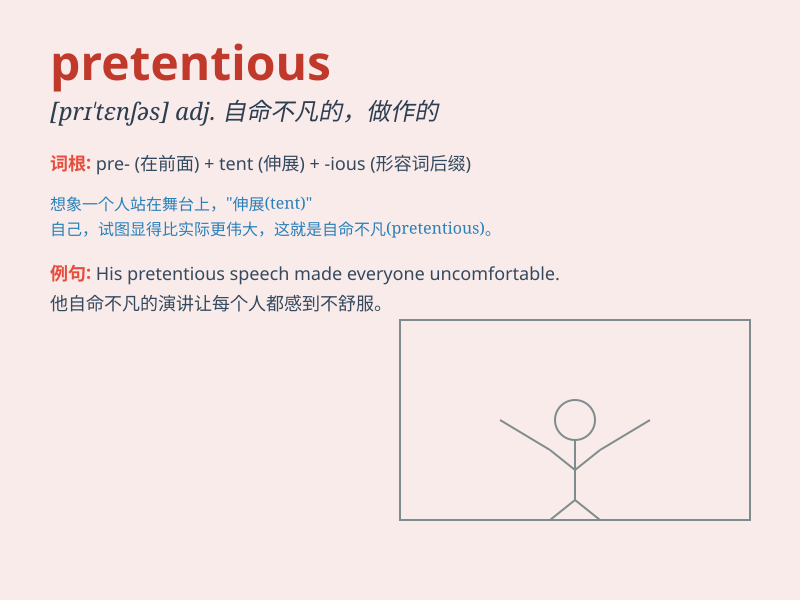

## pretentious

**英音:** _[prɪ\'tenʃəs]_ **美音:** _[prɪ\'tɛnʃəs]_

**译义:** *adj.自命不凡的*

### 短语

+ **pretentious language:** _矫揉造作的语言_

+ **pretentious style:** _做作的风格_

+ **pretentious behavior:** _自负的行为_

+ **pretentious art:** _自命不凡的艺术_

+ **pretentious attitude:** _自命不凡的态度_

### 例句

#### 例句1

> **His pretentious manner made everyone uncomfortable at the
party.**

**中文翻译:** 他做作的举止让聚会上的每个人都感到不舒服。

**单词释义:** 做作的；自命不凡的

#### 例句2

> **The book\'s pretentious language was a turn-off for many
readers.**

**中文翻译:** 这本书浮夸的语言让很多读者失去了兴趣。

**单词释义:** 浮夸的；虚饰的

#### 例句3

> **She wore a pretentious outfit that seemed more for show than for
practicality.**

**中文翻译:**
她穿着一套华而不实的服装，看起来更像是为了展示而不是实用。

**单词释义:** 华而不实的

### 背诵小故事

> A young artist showed his paintings and claimed they were
masterpieces. But his style was too complex and seemed pretentious.
People saw through his false show of greatness. Eventually, he learned
to be genuine.

**一位年轻的艺术家展示了他的画作，并声称它们是杰作。但他的风格过于复杂，显得自命不凡。人们看穿了他虚假的伟大表现。最终，他学会了真诚。**

### 图义

