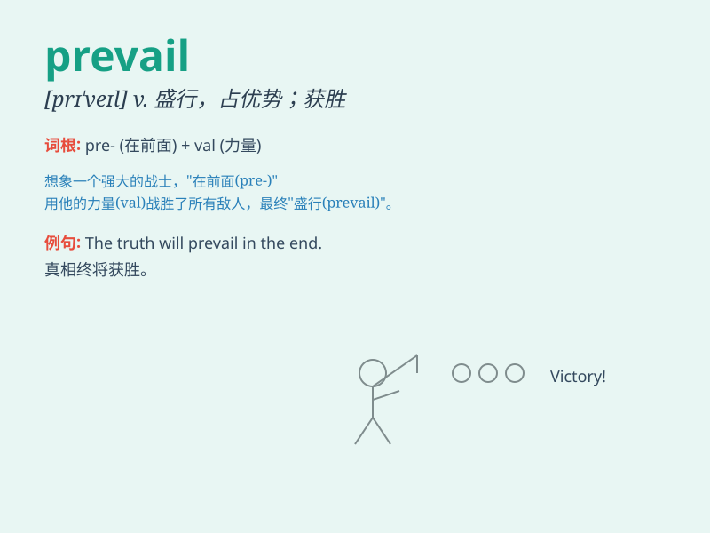

## prevail

**英音:** _[prɪ\'veɪl]_ **美音:** _[pri\'vel]_

**译义:** *vi.流行,盛行,获胜,成功*

### 短语

+ **prevail upon:** _说服；诱使_

+ **prevail over:** _战胜；压倒；占优势_

+ **prevail through:** _通过\...获胜；凭借\...成功_

+ **prevail in:** _在\...中盛行；在\...中占主导地位_

+ **prevail against:** _战胜；击败_

### 例句

#### 例句1

> **Justice will prevail in the end.**

**中文翻译:** 正义最终会获胜。

**单词释义:** 获胜；占优势

#### 例句2

> **A belief in magic still prevails among some tribes.**

**中文翻译:** 在一些部落中，对魔法的信仰仍然盛行。

**单词释义:** 盛行；流行

#### 例句3

> **She hoped that common sense would prevail over emotion.**

**中文翻译:** 她希望理智能够战胜情感。

**单词释义:** 战胜；压倒

### 背诵小故事

> In a battle between two armies, one was stronger but the other was
more determined. Eventually, the spirit of the determined army prevailed
and they won. It means to be victorious or dominant.

**在两支军队的战斗中，一方更强，但另一方更坚定。最终，坚定的那支军队获胜了。这意味着胜利或占优势。**

### 图义

