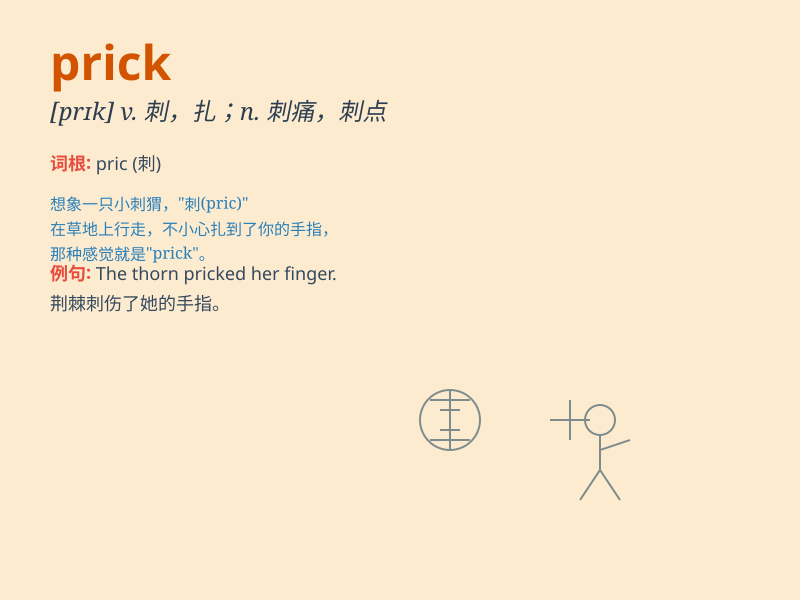

## prick

**英音:** _[prɪk]_ **美音:** _[prɪk]_

**译义:**
*vt.刺,戳,刺痛,竖起vi.刺,竖起n.扎,一刺,刺痛,锥,阴茎adj.竖起的*

### 短语

+ **prick up one\'s ears:** _竖起耳朵；仔细听_

+ **prick out:** _移植；插种_

+ **prick holes in:** _在\...\...上扎孔_

+ **prick someone\'s conscience:** _唤起某人的良知_

+ **prick into action:** _促使行动_

### 例句

#### 例句1

> **He felt a prick on his finger when he touched the thorn.**

**中文翻译:** 当他碰到刺时，他感到手指上被刺了一下。

**单词释义:** 刺，戳

#### 例句2

> **The nurse prick my arm to draw blood.**

**中文翻译:** 护士在我的胳膊上扎针抽血。

**单词释义:** 扎，刺

#### 例句3

> **Her conscience pricked her as she told the lie.**

**中文翻译:** 她撒谎时良心受到了谴责。

**单词释义:** （使）刺痛，（使）内疚

### 背诵小故事

> A little hedgehog was playing in the forest. Suddenly, it got pricked
by a sharp thorn. It felt painful and started to cry. Remember,
\'prick\' means to pierce or cause a sharp pain.

**一只小刺猬在森林里玩耍。突然，它被一根尖锐的刺扎到了。它感到疼痛并开始哭。记住，\'prick\'意思是刺穿或引起刺痛。**

### 图义

