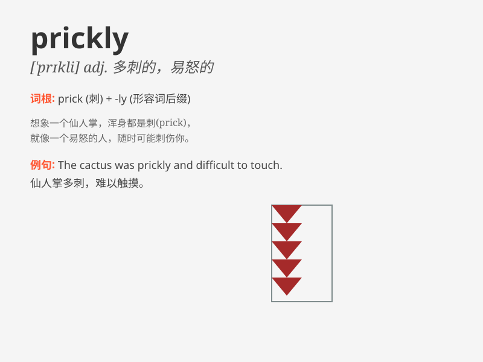

## prickly

**英音:** _[ˈprɪkli]_ **美音:** _[ˈprɪkli]_

**译义:** *adj.多刺的*

### 短语

+ **prickly heat:** _痱子_

+ **prickly pear:** _仙人掌果_

+ **prickly sensation:** _刺痛感_

+ **prickly shrub:** _多刺的灌木_

+ **prickly personality:** _尖刻的性格_

### 例句

#### 例句1

> **The cactus has prickly spines.**

**中文翻译:** 这棵仙人掌有刺人的刺。

**单词释义:** 多刺的；刺痛的

#### 例句2

> **She has a prickly personality and is hard to get along with.**

**中文翻译:** 她性格尖刻，很难相处。

**单词释义:** 易怒的；敏感的

#### 例句3

> **The prickly heat made him uncomfortable.**

**中文翻译:** 痱子让他感到不舒服。

**单词释义:** 引起刺痛的

### 背诵小故事

> A little hedgehog was very prickly. It rolled up into a ball when it
felt threatened. Its prickly spines protected it from danger. Remember,
\'prickly\' means covered with sharp points or difficult to handle, just
like the hedgehog\'s spines.

**一只小刺猬浑身长满了刺，非常扎手。当它感到受到威胁时，就会蜷成一团。它那扎人的尖刺保护它免受危险。记住，'prickly'意思是布满尖锐的刺或难以处理，就像刺猬的刺一样。**

### 图义

