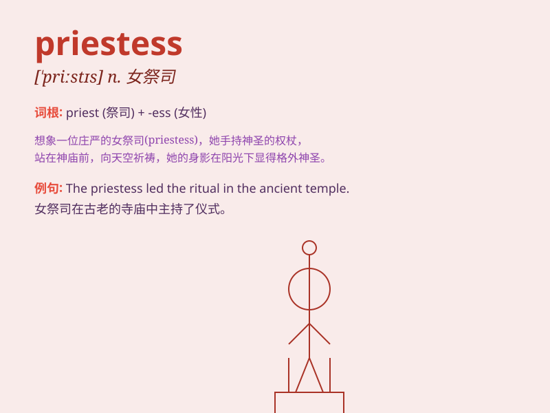

## priestess

**英音:** _[ˈpriːstɪs]_ **美音:** _[ˈpristəs]_

**译义:** *n.女祭司,(基督教会以外的)神职人员*

### 短语

+ **High Priestess:** _女祭司；高级女祭司_

+ **Moon Priestess:** _月亮女祭司_

+ **Priestess of Love:** _爱之女祭司_

+ **Temple Priestess:** _寺庙女祭司_

+ **Spiritual Priestess:** _精神女祭司_

### 例句

#### 例句1

> **The priestess led the religious ceremony with grace and
solemnity.**

**中文翻译:** 这位女祭司优雅而庄重地主持了宗教仪式。

**单词释义:** 女祭司

#### 例句2

> **The ancient temple was served by a group of dedicated
priestesses.**

**中文翻译:** 这座古老的寺庙由一群敬业的女祭司服务。

**单词释义:** 女祭司

#### 例句3

> **The priestess chanted sacred hymns during the ritual.**

**中文翻译:** 在仪式期间，女祭司吟唱着神圣的赞美诗。

**单词释义:** 女祭司

### 背诵小故事

> In a mysterious forest, there was a beautiful priestess. She wore a
long white robe and held a sacred staff. Every day, she prayed for the
peace and happiness of the villagers. Her presence was like a comforting
light in the darkness.

**在一个神秘的森林里，有一位美丽的女祭司。她身着长长的白色长袍，手持一根神圣的法杖。每天，她都为村民们的和平与幸福祈祷。她的存在就像黑暗中的一道令人安心的光。**

### 图义

