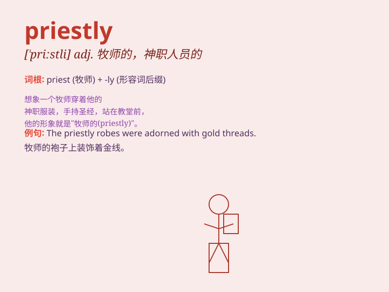

## priestly

**英音:** _[\'priːstlɪ]_ **美音:** _[\'pristli]_

**译义:** *adj.僧的,僧侣似的*

### 短语

+ **priestly office:** _神职_

+ **priestly garb:** _牧师的服装_

+ **priestly duties:** _牧师的职责_

+ **priestly authority:** _牧师的权威_

+ **priestly calling:** _牧师的使命_

### 例句

#### 例句1

> **He has a priestly demeanor and is always calm and composed.**

**中文翻译:** 他有一种牧师般的风度，总是沉着冷静。

**单词释义:** 像牧师的；牧师似的

#### 例句2

> **The priestly duties require a lot of dedication and
discipline.**

**中文翻译:** 牧师的职责需要大量的奉献和纪律。

**单词释义:** 牧师的；与牧师有关的

#### 例句3

> **She wore a priestly robe during the ceremony.**

**中文翻译:** 在仪式期间，她穿着一件牧师的长袍。

**单词释义:** 牧师的

### 背诵小故事

> A young man dreamed of becoming a priestly figure. He spent days and
nights studying religious scriptures. Finally, he achieved his goal and
wore the priestly robe, spreading love and peace.

**一个年轻人梦想成为神职人员。他日夜研读宗教经文。最终，他实现了目标，穿上了神职人员的长袍，传播爱与和平。**

### 图义

