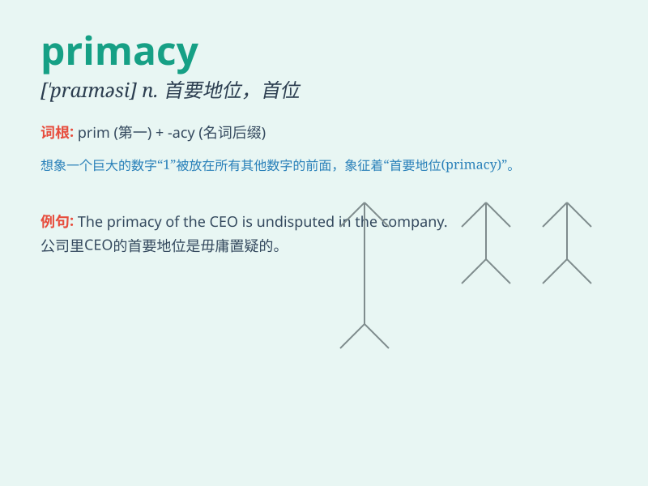

## primacy

**英音:** _[\'praɪməsɪ]_ **美音:** _[\'praɪməsi]_

**译义:** *n.首位*

### 短语

+ **assert primacy:** _主张首要地位_

+ **claim primacy:** _声称首要地位_

+ **recognize primacy:** _承认首要地位_

+ **challenge primacy:** _挑战首要地位_

+ **maintain primacy:** _保持首要地位_

### 例句

#### 例句1

> **The primacy of economic development cannot be ignored in modern
society.**

**中文翻译:** 在现代社会，经济发展的首要地位不容忽视。

**单词释义:** 首要地位；首位

#### 例句2

> **He emphasized the primacy of moral values in education.**

**中文翻译:** 他强调了道德价值观在教育中的首要性。

**单词释义:** 首要性

#### 例句3

> **The primacy of safety must always come first in any industrial
operation.**

**中文翻译:** 在任何工业操作中，安全的首要地位必须始终放在首位。

**单词释义:** 首要地位

### 背诵小故事

> A king always emphasized the primacy of his power. One day, a rebel
questioned this. But the king firmly said: \'My primacy is
unchallengeable!\' meaning his supreme and foremost position.

**一位国王总是强调他权力的首要地位。有一天，一个反叛者对此提出质疑。但国王坚定地说：'我的首要地位无可挑战！'意思是他至高无上且最重要的地位。**

### 图义

