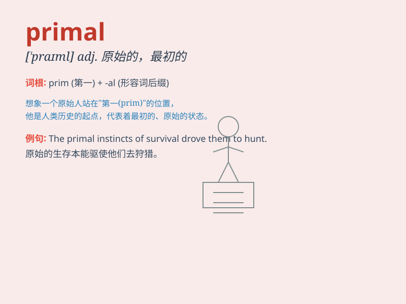

## primal

**英音:** _[\'praɪm(ə)l]_ **美音:** _[\'praɪml]_

**译义:** *adj.最初的*

### 短语

+ **primal urge:** _原始冲动_

+ **primal scene:** _原始场景_

+ **primal fear:** _原始恐惧_

+ **primal instinct:** _原始本能_

+ **primal chaos:** _原初混沌_

### 例句

#### 例句1

> **The primal urge for survival drove him forward.**

**中文翻译:** 生存的原始冲动驱使他前进。

**单词释义:** 原始的；最初的

#### 例句2

> **Primal fears often haunt us in our dreams.**

**中文翻译:** 原始的恐惧经常在我们的梦中萦绕。

**单词释义:** 原始的；根本的

#### 例句3

> **The primal scene of her childhood remained etched in her
memory.**

**中文翻译:** 她童年的最初场景仍然深深地印在她的记忆中。

**单词释义:** 最初的；首要的

### 背诵小故事

> A brave hunter was lost in a deep forest. He felt a primal fear as
night fell. Suddenly, he saw a primal fire in the distance, which gave
him hope and led him back home. The fire was like his primal instinct to
survive.

**一位勇敢的猎人在幽深的森林中迷路了。夜幕降临时，他感到一种原始的恐惧。突然，他看到远处有一团原始的火，这给了他希望并引领他回家。这团火就像他生存的原始本能。**

### 图义

