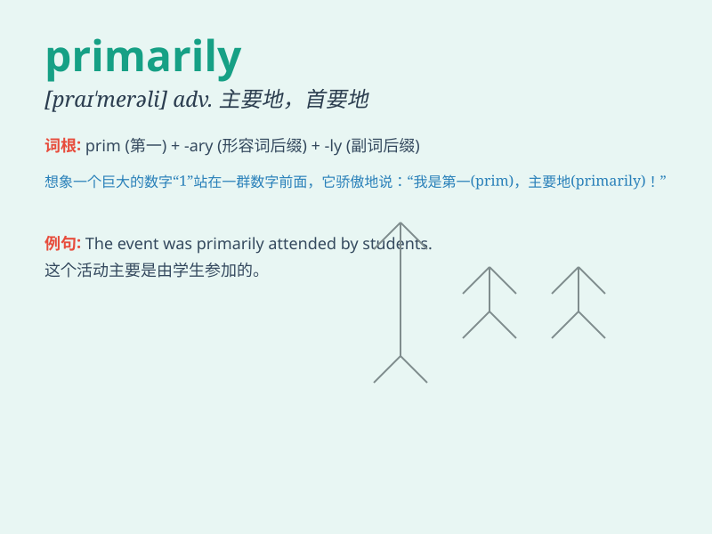

## primarily

**英音:** _[\'praɪm(ə)rɪlɪ; praɪ\'mer-]_ **美音:**
_[praɪ\'mɛrəli]_

**译义:** *adv.首先,起初,主要地,根本上*

### 短语

+ **primarily concerned:** _主要关注_

+ **primarily responsible:** _主要负责_

+ **primarily aimed at:** _主要针对_

+ **primarily focused on:** _主要聚焦于_

+ **primarily dependent on:** _主要依赖于_

### 例句

#### 例句1

> **The company is primarily focused on developing new products.**

**中文翻译:** 这家公司主要专注于开发新产品。

**单词释义:** 主要地；首要地

#### 例句2

> **She is primarily interested in art and music.**

**中文翻译:** 她主要对艺术和音乐感兴趣。

**单词释义:** 主要地；根本上

#### 例句3

> **This book is primarily intended for beginners.**

**中文翻译:** 这本书主要是为初学者准备的。

**单词释义:** 主要地；起初

### 背诵小故事

> Once upon a time, a little town was primarily known for its beautiful
gardens. Everyone came here mainly to enjoy the flowers. \'Primarily\'
means mainly or mostly. So, the town was famous mostly for the gardens.

**从前，有一个小镇主要因其美丽的花园而闻名。每个人来这里主要是为了欣赏花朵。'primarily'意思是主要地、多半地。所以，这个小镇多半是因为花园而出名。**

### 图义

