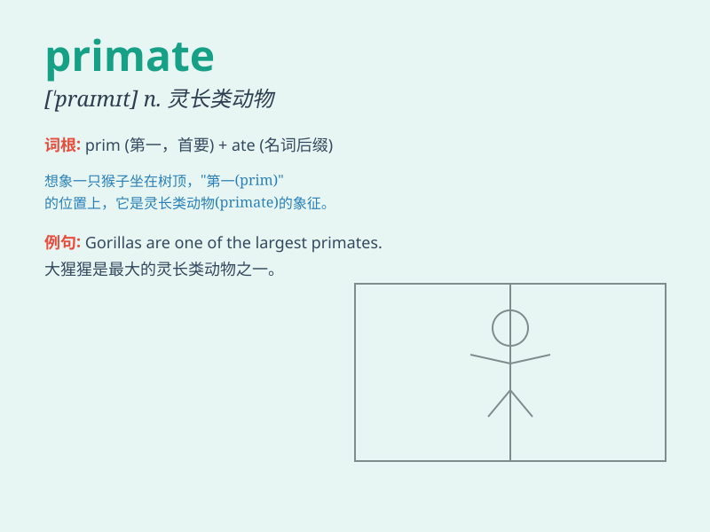

## primate

**英音:** _[\'praɪmeɪt; -mət]_ **美音:** _[\'praɪmet]_

**译义:** *n.首领,大主教,灵长类的动物*

### 短语

+ **primate city:** _首位城市；最大城市_

+ **lower primate:** _低等灵长类动物_

+ **primate evolution:** _灵长类动物进化_

+ **primate research:** _灵长类研究_

+ **primate habitat:** _灵长类动物栖息地_

### 例句

#### 例句1

> **The primate exhibit at the zoo is always popular with
visitors.**

**中文翻译:** 动物园里的灵长类动物展览总是很受游客欢迎。

**单词释义:** 灵长类动物

#### 例句2

> **The study of primate behavior is crucial for understanding human
evolution.**

**中文翻译:** 对灵长类动物行为的研究对于理解人类进化至关重要。

**单词释义:** 灵长类动物

#### 例句3

> **The primate sanctuary provides a safe haven for endangered
species.**

**中文翻译:** 这个灵长类动物保护区为濒危物种提供了一个安全的庇护所。

**单词释义:** 灵长类动物

### 背诵小故事

> In a deep forest, a wise primate led its group. It was smart and knew
how to find food and protect them. The primate was like a leader,
showing others the way. Remember, a primate is a chief among animals!

**在一片幽深的森林里，一只聪明的灵长类动物带领着它的族群。它很聪明，知道如何寻找食物和保护它们。这只灵长类动物就像一个领袖，为其他动物指明道路。记住，primate
就是灵长类动物！**

### 图义

