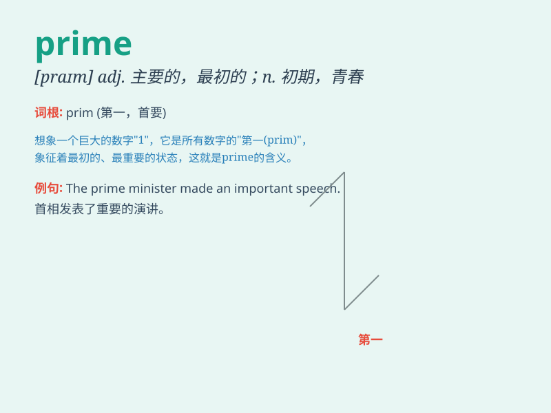

## prime

**英音:** _[praɪm]_ **美音:** _[praɪm]_

**译义:**
*n.最初,青春,精华adj.主要的,最初的,有青春活力的,最好的,第一流的,根本的,[数]素数的v.预先准备好,\<口>让人吃(喝)足,灌注,填装*

### 短语

+ **prime minister:** _首相；总理_

+ **prime time:** _黄金时间_

+ **prime number:** _素数；质数_

+ **in prime condition:** _处于最佳状态_

+ **prime the pump:** _采取措施使某事发展_

### 例句

#### 例句1

> **The prime minister is visiting our city today.**

**中文翻译:** 首相今天正在访问我们的城市。

**单词释义:** 首相；总理

#### 例句2

> **This is the prime time for studying.**

**中文翻译:** 这是学习的最佳时间。

**单词释义:** 最佳的；首要的

#### 例句3

> **She was in her prime when she won the championship.**

**中文翻译:** 她赢得冠军的时候正值盛年。

**单词释义:** 盛年；壮年

### 背诵小故事

> A young detective was on a mission to catch the prime suspect in a
robbery case. The suspect was known for being the first and most
important person in the criminal gang. Finally, the detective found the
prime evidence and caught the suspect.

**一位年轻的侦探正在执行一项任务，要抓住一起抢劫案的首要嫌疑人。这个嫌疑人是犯罪团伙中的第一和最重要的人物。最终，侦探找到了关键证据并抓住了嫌疑人。**

### 图义

