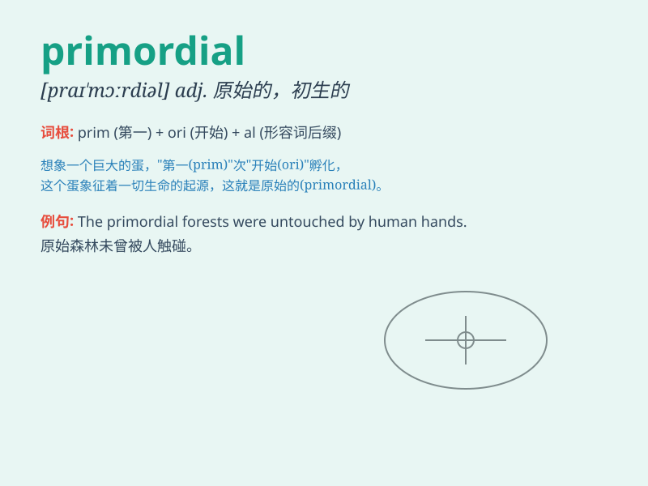

## primordial

**英音:** _[praɪ\'mɔːdɪəl]_ **美音:** _[praɪ\'mɔrdɪəl]_

**译义:** *adj.原始的*

### 短语

+ **primordial soup:**
_原生汤（指地球生命出现之前存在的有机化合物的混合物）_

+ **primordial nature:** _原始本性_

+ **primordial cell:** _原始细胞_

+ **primordial emotion:** _原始情感_

+ **primordial force:** _原始力量_

### 例句

#### 例句1

> **The primordial soup is believed to be the origin of life on
Earth.**

**中文翻译:** 原始汤被认为是地球上生命的起源。

**单词释义:** 原始的；最初的

#### 例句2

> **He had a primordial fear of the dark.**

**中文翻译:** 他对黑暗有一种本能的恐惧。

**单词释义:** 本能的；天生的

#### 例句3

> **The primordial task of this project is to collect data.**

**中文翻译:** 这个项目的首要任务是收集数据。

**单词释义:** 首要的；主要的

### 背诵小故事

>
想象远古时代，世界一片混沌。有一个神秘的力量，被称为primordial，它是最初的、原始的，创造了万物的基础。就像最初的火种，带来了生命和希望。

**想象远古时被称为'primordial（最初的、原始的）'的神秘力量创造万物基础，像最初的火种带来生命希望的故事。**

### 图义

