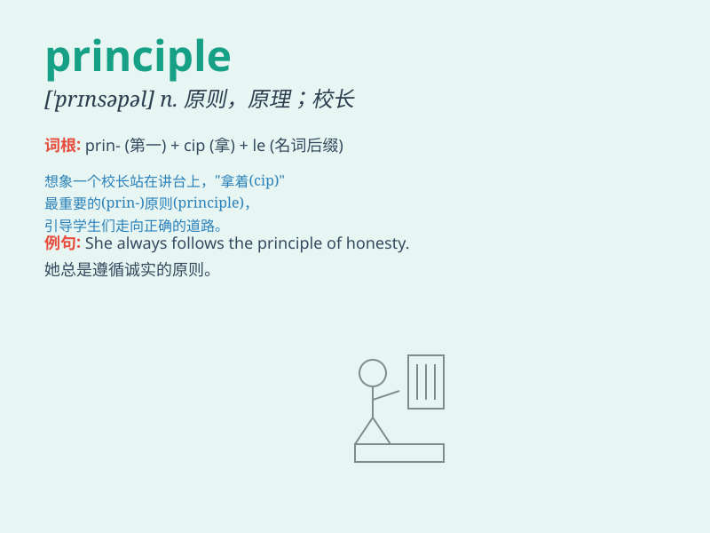

## principle

**英音:** _[\'prɪnsɪp(ə)l]_ **美音:** _[\'prɪnsəpl]_

**译义:** *n.法则,原则,原理*

### 短语

+ **in principle:** _原则上；大体上_

+ **on principle:** _根据原则；按照原则_

+ **fundamental principle:** _基本原理；基本原则_

+ **operating principle:** _操作原理；工作原理_

+ **design principle:** _设计原则_

### 例句

#### 例句1

> **The principle of equality is fundamental in a democratic
society.**

**中文翻译:** 平等的原则在民主社会中是基础的。

**单词释义:** 原则；原理

#### 例句2

> **He always adheres to the principle of honesty in his
business.**

**中文翻译:** 他在生意中总是坚持诚实的原则。

**单词释义:** 原则

#### 例句3

> **The principle of this machine is quite simple.**

**中文翻译:** 这台机器的原理相当简单。

**单词释义:** 原理

### 背诵小故事

> A young scientist was confused about his research. But when he
remembered the principle of \'honesty and accuracy\', he finally made a
great discovery. It taught him to always follow the right principles in
his work.

**一位年轻的科学家对他的研究感到困惑。但当他想起'诚实和准确'的原则时，他最终有了重大发现。这教会他在工作中始终遵循正确的原则。**

### 图义

