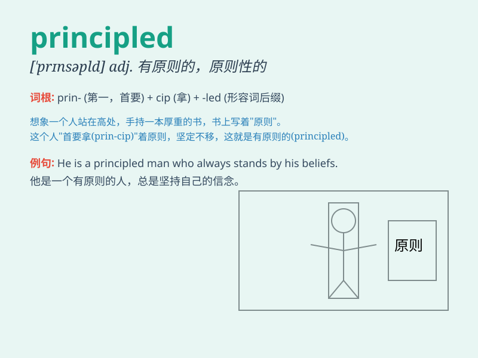

## principled

**英音:** _[\'prɪnsɪp(ə)ld]_ **美音:** _[\'prɪnsəpld]_

**译义:** *adj.原则性强的,有(道德)原则的*

### 短语

+ **principled stand:** _有原则的立场_

+ **principled approach:** _原则性的方法_

+ **principled decision:** _有原则的决定_

+ **principled person:** _有原则的人_

+ **principled objection:** _原则性的反对_

### 例句

#### 例句1

> **He is a highly principled person who always adheres to his moral
beliefs.**

**中文翻译:** 他是一个非常有原则的人，总是坚守自己的道德信仰。

**单词释义:** 有原则的

#### 例句2

> **The company\'s decision was principled and based on ethical
considerations.**

**中文翻译:** 公司的决定是有原则的，是基于道德考量的。

**单词释义:** 原则性的

#### 例句3

> **She took a principled stand against injustice.**

**中文翻译:** 她坚定地采取有原则的立场反对不公正。

**单词释义:** 有原则的

### 背诵小故事

> A young man named Tom always stuck to his principles. No matter how
difficult the situation was, he refused to do anything against his
beliefs. This made him a principled person.

**一个叫汤姆的年轻人总是坚守自己的原则。无论情况多么艰难，他都拒绝做任何违背自己信念的事情。这使他成为了一个有原则的人。**

### 图义

