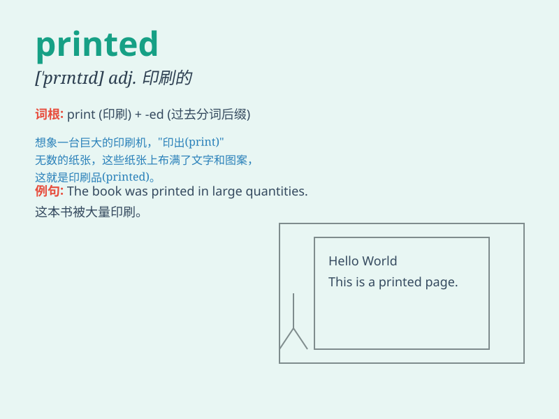

## printed

**英音:** _[\'prɪntɪd]_ **美音:** _[\'prɪntɪd]_

**译义:** *adj.印刷的,已印好的*

### 短语

+ **printed matter:** _印刷品_

+ **printed circuit:** _印刷电路_

+ **printed page:** _印刷页_

+ **printed dress:** _印花连衣裙_

+ **printed form:** _印刷表格_

### 例句

#### 例句1

> **The book has beautifully printed illustrations.**

**中文翻译:** 这本书有印刷精美的插图。

**单词释义:** 印刷的

#### 例句2

> **She wore a printed dress to the party.**

**中文翻译:** 她穿着一条印花连衣裙去参加聚会。

**单词释义:** 印花的

#### 例句3

> **The printed instructions were very clear.**

**中文翻译:** 印刷的说明非常清晰。

**单词释义:** 印刷的

### 背诵小故事

> A little girl was very excited when she received a printed letter
from her friend. The letter had beautiful pictures and words. She kept
it carefully as it was so special.

**一个小女孩收到朋友寄来的打印信件时非常兴奋。这封信有漂亮的图片和文字。她小心翼翼地保存着，因为它太特别了。**

### 图义

