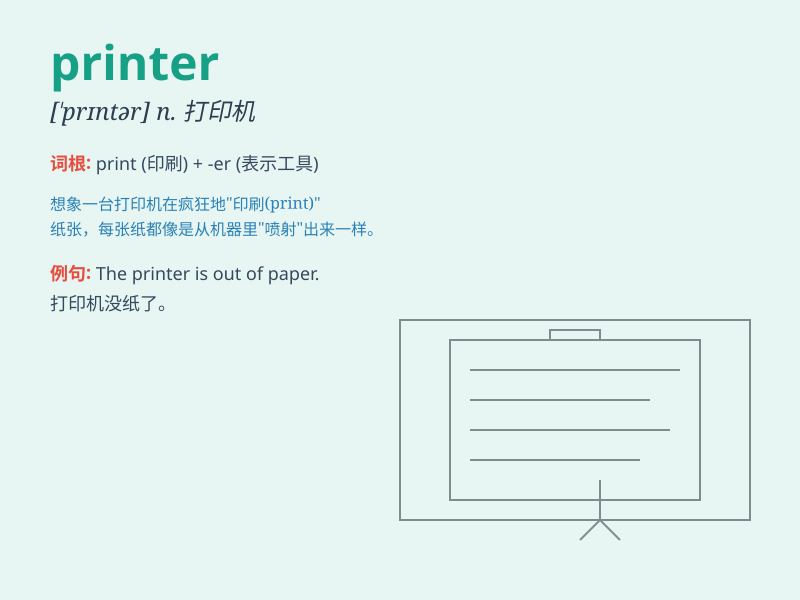

## printer

**英音:** _[\'prɪntə]_ **美音:** _[\'prɪntɚ]_

**译义:** *n.印刷工,打印机*

### 短语

+ **laser printer:** _激光打印机_

+ **inkjet printer:** _喷墨打印机_

+ **3D printer:** _3D 打印机_

+ **network printer:** _网络打印机_

+ **portable printer:** _便携式打印机_

### 例句

#### 例句1

> **The printer is out of ink.**

**中文翻译:** 这台打印机没墨了。

**单词释义:** 打印机

#### 例句2

> **I need to buy a new printer for my office.**

**中文翻译:** 我需要为我的办公室买一台新打印机。

**单词释义:** 打印机

#### 例句3

> **The color printer can print high-quality images.**

**中文翻译:** 这台彩色打印机可以打印高质量的图像。

**单词释义:** 打印机

### 背诵小故事

> One day, I needed to print an important document. I rushed to the
store and asked the clerk for a \'printer\'. He showed me several models
and explained their features. Finally, I chose one and it helped me get
my work done perfectly.

**有一天，我需要打印一份重要文件。我冲到商店并向店员要一台'打印机'。他给我展示了几款并解释了它们的特点。最后，我选了一台，它完美地帮我完成了工作。**

### 图义

