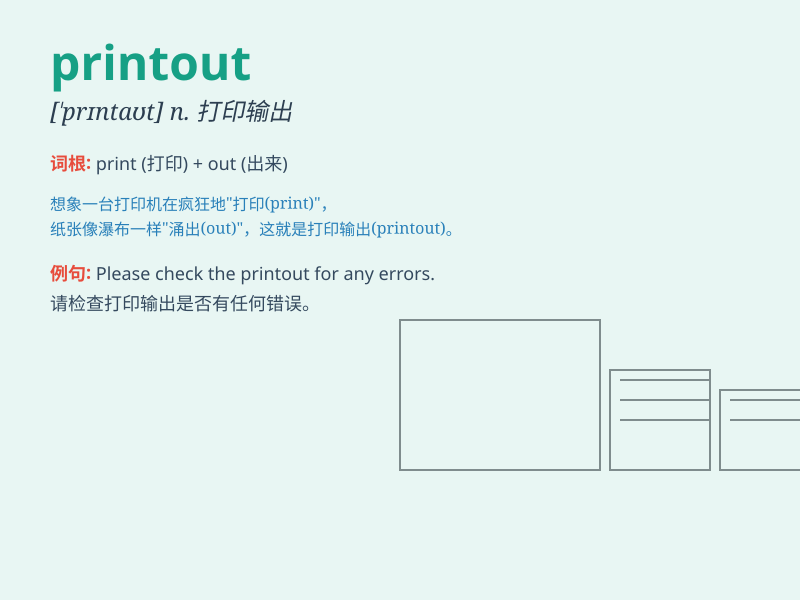

## printout

**英音:** _[\'prɪntaʊt]_ **美音:** _[\'prɪntaʊt]_

**译义:** *n.[计]打印输出*

### 短语

+ **printout sheet:** _打印输出表_

+ **color printout:** _彩色打印输出_

+ **final printout:** _最终打印输出_

+ **detailed printout:** _详细的打印输出_

+ **system printout:** _系统打印输出_

### 例句

#### 例句1

> **The printout of the report was clear and easy to read.**

**中文翻译:** 这份报告的打印输出清晰且易于阅读。

**单词释义:** 打印输出

#### 例句2

> **I need a printout of the presentation for the meeting.**

**中文翻译:** 我需要为会议准备一份演示文稿的打印输出。

**单词释义:** 打印输出

#### 例句3

> **The computer malfunctioned and the printout was incomplete.**

**中文翻译:** 电脑出了故障，打印输出不完整。

**单词释义:** 打印输出

### 背诵小故事

> One day, the teacher needed to give each student a special printout.
It had important study materials. Tom was the first to get it and was
very happy. The printout helped him learn a lot.

**一天，老师需要给每个学生一份特别的打印件。它有重要的学习资料。汤姆第一个拿到，非常高兴。这份打印件帮助他学到了很多。**

### 图义

