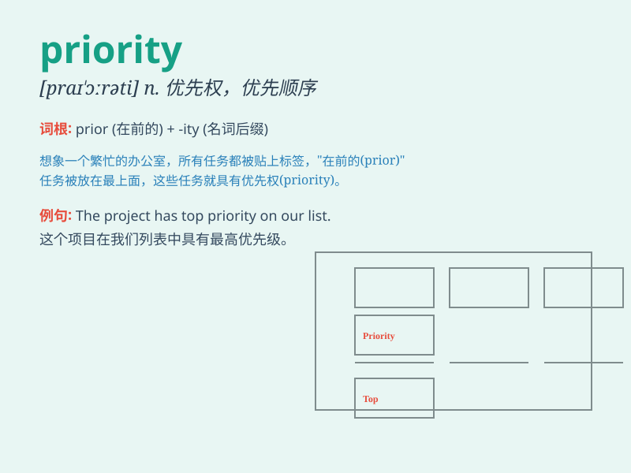

## priority

**英音:** _[praɪ\'ɒrɪtɪ]_ **美音:** _[praɪ\'ɔrəti]_

**译义:** *n.先,前,优先,优先权*

### 短语

+ **give priority to:** _优先考虑；给......以优先权_

+ **top priority:** _首要任务；当务之急_

+ **take priority:** _优先；居先_

+ **priority list:** _优先列表_

+ **priority area:** _优先领域_

### 例句

#### 例句1

> **Safety is our top priority in this project.**

**中文翻译:** 在这个项目中，安全是我们的首要任务。

**单词释义:** 首要任务；优先事项

#### 例句2

> **The government\'s priority is to reduce unemployment.**

**中文翻译:** 政府的当务之急是降低失业率。

**单词释义:** 当务之急

#### 例句3

> **You should set your priorities before starting the work.**

**中文翻译:** 在开始工作之前，你应该确定你的优先事项。

**单词释义:** 优先事项

### 背诵小故事

> A king was choosing a new general. Many soldiers wanted the position.
But one soldier showed great skills and strategies. The king gave him
priority because he was the best fit.

**一位国王正在挑选新的将军。许多士兵都想要这个职位。但有一位士兵展现出了高超的技能和策略。国王优先考虑了他，因为他是最合适的人选。**

### 图义

