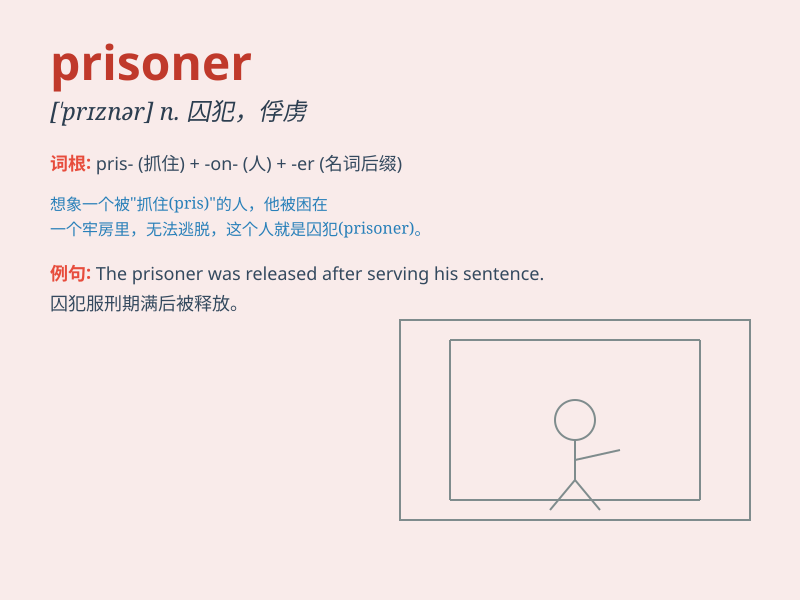

## prisoner

**英音:** _[\'prɪz(ə)nə]_ **美音:** _[\'prɪznɚ]_

**译义:** *adj.囚犯的n.战俘*

### 短语

+ **political prisoner:** _政治犯_

+ **prisoner of war:** _战俘_

+ **take prisoner:** _俘虏；生擒_

+ **hold prisoner:** _囚禁；关押_

+ **set prisoner free:** _释放囚犯_

### 例句

#### 例句1

> **The prisoner was held in a maximum-security facility.**

**中文翻译:** 这名囚犯被关押在一个高度戒备的设施里。

**单词释义:** 囚犯

#### 例句2

> **The police are questioning the prisoner about the robbery.**

**中文翻译:** 警方正在就抢劫案询问这名囚犯。

**单词释义:** 囚犯

#### 例句3

> **The prisoner managed to escape from the jail.**

**中文翻译:** 这名囚犯设法从监狱逃跑了。

**单词释义:** 囚犯

### 背诵小故事

> A brave detective was on a mission to rescue a prisoner who was
wrongly accused. The prisoner was kept in a dark cell, longing for
freedom. Finally, with the detective\'s help, the prisoner was set free.

**一位勇敢的侦探正在执行一项任务，去营救一名被冤枉的囚犯。这名囚犯被关在黑暗的牢房里，渴望着自由。最终，在侦探的帮助下，囚犯重获自由。**

### 图义

