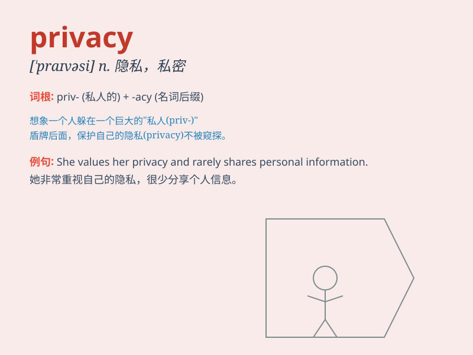

## privacy

**英音:** _[\'prɪvəsɪ; \'praɪ-]_ **美音:**
_[\'praɪvəsi]_

**译义:** *n.独处而不受干扰,秘密*

### 短语

+ **in privacy:** _私下地；秘密地_

+ **privacy policy:** _隐私政策_

+ **right to privacy:** _隐私权_

+ **invade privacy:** _侵犯隐私_

+ **privacy protection:** _隐私保护_

### 例句

#### 例句1

> **She values her privacy and doesn\'t like to share personal
details.**

**中文翻译:** 她重视自己的隐私，不喜欢分享个人细节。

**单词释义:** 隐私

#### 例句2

> **The new law aims to protect citizens\' privacy.**

**中文翻译:** 新法律旨在保护公民的隐私。

**单词释义:** 隐私

#### 例句3

> **I need some privacy to think about this problem.**

**中文翻译:** 我需要一些隐私来思考这个问题。

**单词释义:** 隐私；独处

### 背诵小故事

> A spy was always in danger of having his privacy invaded. One day, he
found a secret cave to hide and finally got the privacy he longed for.
It means the state of being alone and not watched or disturbed.

**一名间谍总是面临着隐私被侵犯的危险。有一天，他找到了一个秘密洞穴藏身，终于获得了他渴望的隐私。这个词的意思是独处且不被注视或打扰的状态。**

### 图义

