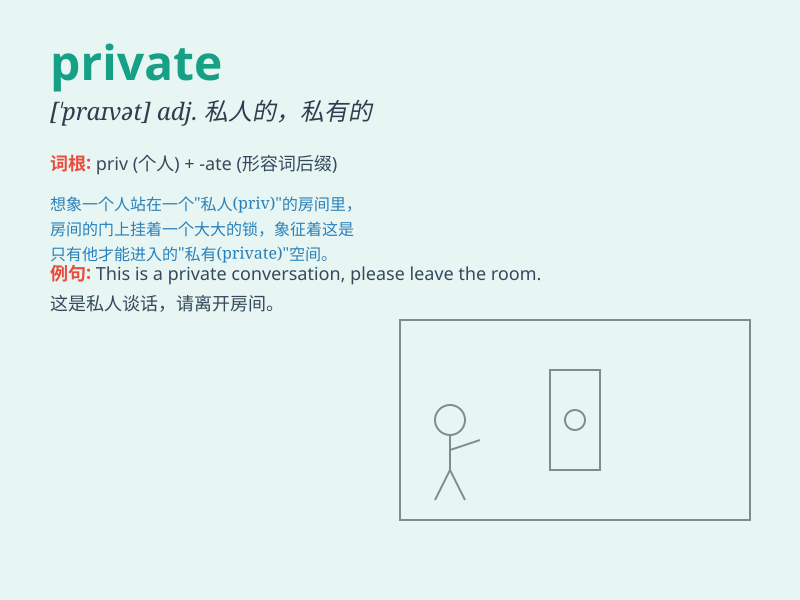

## private

**英音:** _[ˈpraɪvɪt]_ **美音:** _[ˈpraɪvɪt]_

**译义:** *adj.私人的,私有的,私营的,秘密的n.士兵*

### 短语

+ **private life:** _私人生活_

+ **private property:** _私有财产_

+ **private school:** _私立学校_

+ **private detective:** _私家侦探_

+ **in private:** _私下地；秘密地_

### 例句

#### 例句1

> **I have a private room in the hotel.**

**中文翻译:** 我在酒店有一个私人房间。

**单词释义:** 私人的

#### 例句2

> **The meeting was private and only a few people were invited.**

**中文翻译:** 这次会议是私密的，只有少数人受到了邀请。

**单词释义:** 私密的；秘密的

#### 例句3

> **He served in the private sector before joining the
government.**

**中文翻译:** 在加入政府之前，他在私营部门工作。

**单词释义:** 私营的

### 背诵小故事

> A soldier was sent on a private mission. He had to keep it secret and
not tell anyone. It was a task only for him. \'Private\' means personal
and secret, just like this special mission.

**一名士兵被派去执行一项私人任务。他必须保密，不告诉任何人。这是只属于他的任务。'private'意思是个人的、秘密的，就像这个特殊任务一样。**

### 图义

