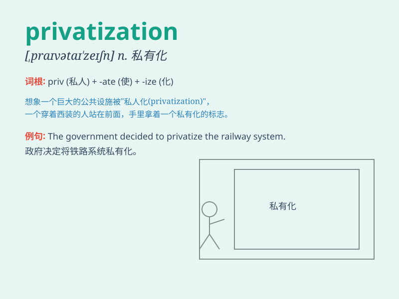

## privatization

**英音:** _[ˌpraɪvətaɪˈzeɪʃən]_ **美音:**
_[ˌpraɪvətəˈzeɪʃən]_

**译义:**
*n.私有化，将公共或政府拥有的企业或服务转为私人所有和经营的过程*

### 短语

+ **privatization process:** _私有化进程_

+ **privatization policy:** _私有化政策_

+ **accelerate privatization:** _加速私有化_

+ **oppose privatization:** _反对私有化_

+ **privatization plan:** _私有化计划_

### 例句

#### 例句1

> **The privatization of the state-owned enterprises was
controversial.**

**中文翻译:** 国有企业的私有化存在争议。

**单词释义:** 私有化

#### 例句2

> **Privatization has brought some benefits to the economy.**

**中文翻译:** 私有化给经济带来了一些好处。

**单词释义:** 私有化

#### 例句3

> **The government is considering the privatization of the postal
service.**

**中文翻译:** 政府正在考虑邮政服务的私有化。

**单词释义:** 私有化

### 背诵小故事

> A small town\'s public library was in trouble. But with
privatization, a rich entrepreneur took it over. He made it better with
new books and comfy chairs. Privatization saved the day!

**一个小镇的公共图书馆陷入困境。但通过私有化，一位富有的企业家接管了它。他用新书和舒适的椅子让它变得更好。私有化挽救了局面！**

### 图义

