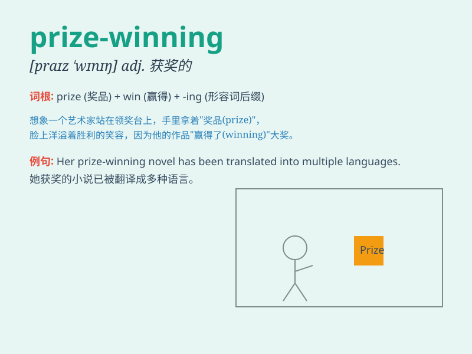

## prize-winning

**英音:** _[ˈpraɪz.wɪnɪŋ]_ **美音:** _[ˈpraɪz.wɪnɪŋ]_

**译义:** *adj.得奖的；获奖的*

### 短语

+ **prize-winning author:** _获奖作家_

+ **prize-winning book:** _获奖图书_

+ **prize-winning performance:** _获奖表演_

+ **prize-winning design:** _获奖设计_

+ **prize-winning project:** _获奖项目_

### 例句

#### 例句1

> **The prize-winning novel has captured the hearts of readers
worldwide.**

**中文翻译:** 这部获奖的小说已经俘获了全世界读者的心。

**单词释义:** 获奖的

#### 例句2

> **She is a prize-winning scientist known for her groundbreaking
research.**

**中文翻译:** 她是一位因开创性研究而闻名的获奖科学家。

**单词释义:** 获奖的

#### 例句3

> **The prize-winning athlete received a standing ovation.**

**中文翻译:** 这位获奖的运动员受到了全场起立鼓掌。

**单词释义:** 获奖的

### 背诵小故事

> Once upon a time, there was a painter. His artworks were so excellent
that he won many prizes. People called him a prize-winning artist. His
success came from his hard work and talent.

**从前，有一位画家。他的作品非常出色，赢得了很多奖项。人们称他为获奖的艺术家。他的成功源于他的努力和天赋。**

### 图义

