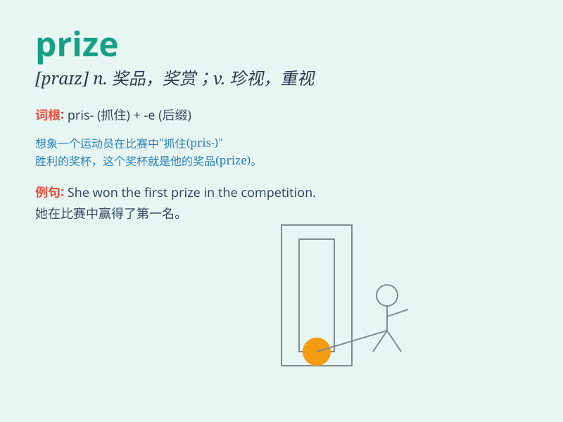

## prize

**英音:** _[praɪz]_ **美音:** _[praɪz]_

**译义:**
*n.奖赏,奖金,奖品,捕获,捕获物,战利品adj.得奖的vt.珍视,估价,捕获,撬,撬开*

### 短语

+ **prize winner:** _获奖者_

+ **prize money:** _奖金_

+ **first prize:** _一等奖_

+ **consolation prize:** _安慰奖_

+ **prize draw:** _抽奖_

### 例句

#### 例句1

> **She won the first prize in the singing competition.**

**中文翻译:** 她在歌唱比赛中获得了一等奖。

**单词释义:** 奖；奖赏；奖品

#### 例句2

> **The Nobel Prize is highly prestigious.**

**中文翻译:** 诺贝尔奖极有声望。

**单词释义:** 奖；奖赏

#### 例句3

> **He prized his collection of stamps above all else.**

**中文翻译:** 他把自己收集的邮票看得比其他一切都珍贵。

**单词释义:** 珍视；高度重视

### 背诵小故事

> One day, I participated in a competition. I worked hard and finally
won the first place. The trophy I received was my prize. It made me feel
so proud and happy.

**有一天，我参加了一场比赛。我努力拼搏，最终获得了第一名。我得到的奖杯就是我的奖品。这让我感到无比骄傲和开心。**

### 图义

