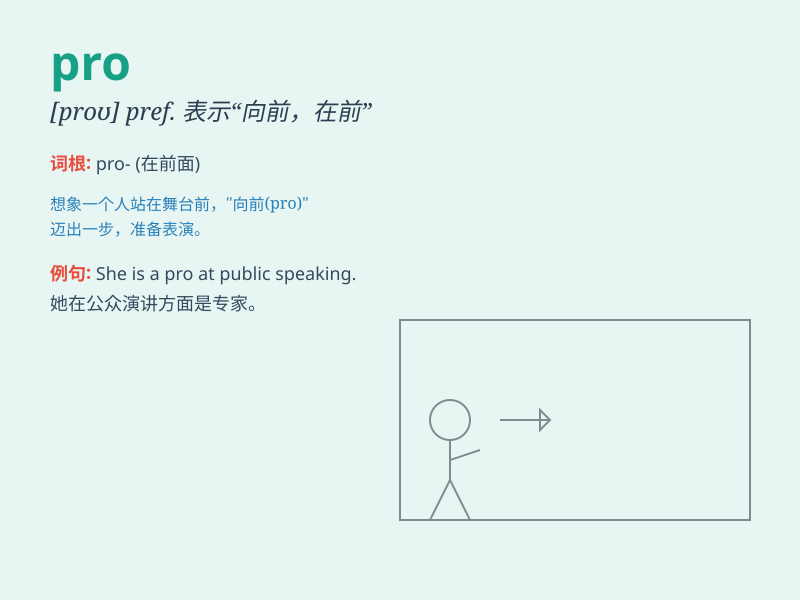

## pro

**英音:** _[prəʊ]_ **美音:** _[pro]_

**译义:** *adv.正面地 (英国)档案局 PRO(Public Record Office)*

### 短语

+ **pro and con:** _正反两方面；赞成和反对_

+ **pro forma:** _形式上的；预计的_

+ **pro rata:** _按比例；成比例_

+ **pro tem:** _暂时；临时_

+ **pro bono:** _无偿的；为了公益的_

### 例句

#### 例句1

> **He is a pro at playing the guitar.**

**中文翻译:** 他是弹吉他的高手。

**单词释义:** 高手；行家

#### 例句2

> **The pro golfer won the tournament.**

**中文翻译:** 这位职业高尔夫球手赢得了比赛。

**单词释义:** 职业选手；老手

#### 例句3

> **I\'m not a pro, but I\'ll do my best.**

**中文翻译:** 我不是行家，但我会尽力的。

**单词释义:** 行家；专家

### 背诵小故事

>
从前有个运动员，总是在比赛前（pro）积极准备，不断练习，最终在赛场上表现出色，赢得了冠军。他的这种前瞻性的准备就是\'pro\'所代表的预先、向前的意思。

**从前有个运动员总是在赛前积极准备，体现\'pro\'预先、向前的含义，帮助记忆这个单词。**

### 图义

