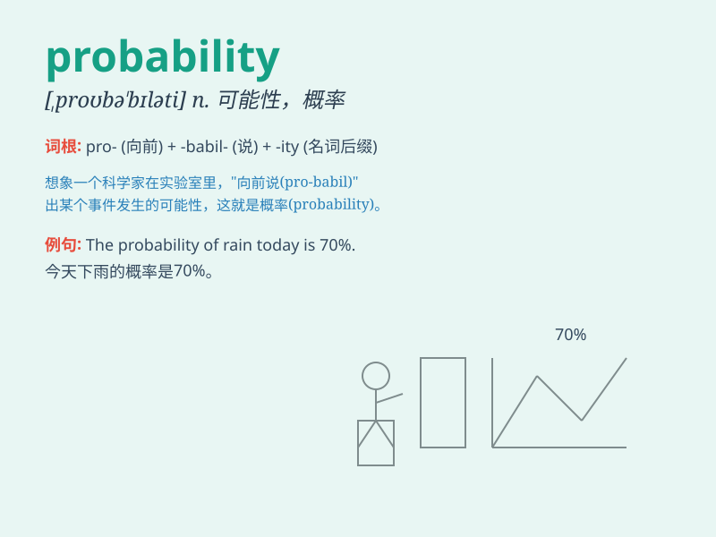

## probability

**英音:** _[prɒbə\'bɪlɪtɪ]_ **美音:**
_[\'prɑbə\'bɪləti]_

**译义:** *n.可能性,或然性,概率*

### 短语

+ **probability distribution:** _概率分布_

+ **probability theory:** _概率论_

+ **high probability:** _高概率_

+ **low probability:** _低概率_

+ **probability density:** _概率密度_

### 例句

#### 例句1

> **The probability of winning the lottery is extremely low.**

**中文翻译:** 中彩票的概率极低。

**单词释义:** 可能性；概率

#### 例句2

> **There is a high probability that it will rain tomorrow.**

**中文翻译:** 明天很有可能会下雨。

**单词释义:** 可能性；概率

#### 例句3

> **Scientists calculate the probability of various events.**

**中文翻译:** 科学家计算各种事件的概率。

**单词释义:** 概率

### 背诵小故事

> One day, a scientist was conducting an experiment. The outcome was
uncertain. He calculated the probability of success. It was like
guessing how likely it was to rain tomorrow. The higher the probability,
the more likely the event would happen.

**有一天，一位科学家正在进行一项实验。结果是不确定的。他计算成功的可能性。这就像猜测明天有多大可能下雨。可能性越高，事件发生的可能性就越大。**

### 图义

