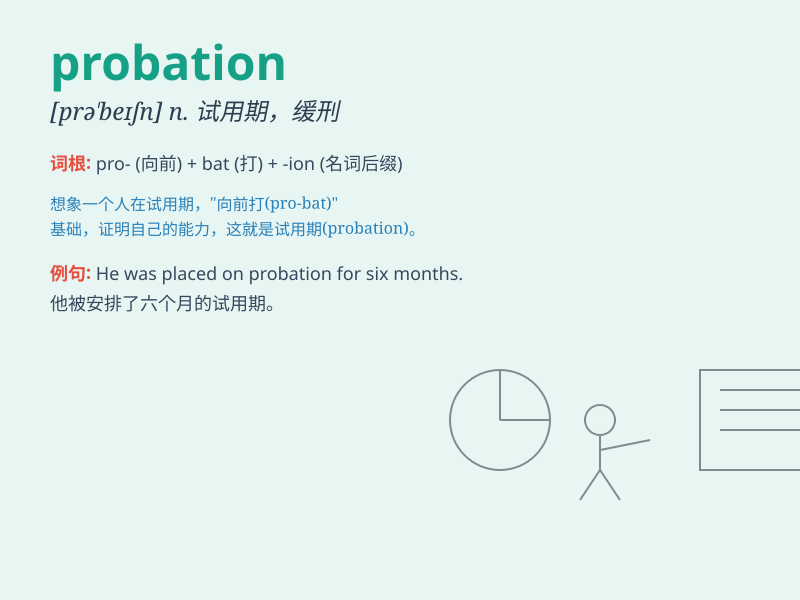

## probation

**英音:** _[prə\'beɪʃ(ə)n]_ **美音:** _[pro\'beʃən]_

**译义:** *n.试用,见习,鉴定,查验,证明,察看,缓刑*

### 短语

+ **probation officer:** _缓刑监督官_

+ **probation period:** _试用期；缓刑期_

+ **be on probation:** _处于试用期；在缓刑中_

+ **probation report:** _缓刑报告_

+ **probation violation:** _违反缓刑规定_

### 例句

#### 例句1

> **He was placed on probation for six months after the theft.**

**中文翻译:** 他在盗窃后被处以六个月的缓刑。

**单词释义:** 缓刑；试用

#### 例句2

> **The new employee is still on probation.**

**中文翻译:** 这位新员工仍在试用期。

**单词释义:** 试用期

#### 例句3

> **She successfully completed her probation period at the
company.**

**中文翻译:** 她成功地完成了在公司的试用期。

**单词释义:** 试用期

### 背诵小故事

> A young man was on probation at work. He had made some mistakes but
was given a chance to prove himself. He worked hard every day, hoping to
pass the probation period and become a regular employee.

**一个年轻人在工作中处于试用期。他犯了一些错误，但得到了一个证明自己的机会。他每天都努力工作，希望能通过试用期，成为正式员工。**

### 图义

