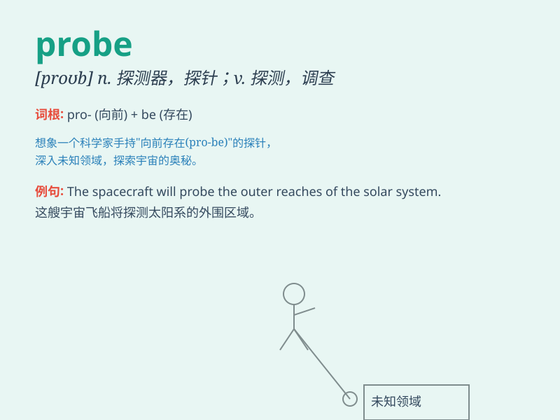

## probe

**英音:** _[prəʊb]_ **美音:** _[prob]_

**译义:** *n.探针,探测器vt.(以探针等)探查,查明*

### 短语

+ **probe into:** _探究；调查_

+ **deep probe:** _深入探究_

+ **probe needle:** _探针；探测针_

+ **space probe:** _航天探测器；太空探测器_

+ **probe test:** _探测测试；探查试验_

### 例句

#### 例句1

> **The doctor probed the wound to check for infection.**

**中文翻译:** 医生探查伤口以检查是否感染。

**单词释义:** 探查；检查

#### 例句2

> **The journalist was determined to probe into the corruption
scandal.**

**中文翻译:** 这位记者决心深入调查这起腐败丑闻。

**单词释义:** 调查；探究

#### 例句3

> **Scientists are using a new probe to study the atmosphere of
Mars.**

**中文翻译:** 科学家们正在使用一种新的探测器来研究火星的大气层。

**单词释义:** 探测器；探头

### 背诵小故事

> A brave astronaut was sent to probe a mysterious planet. He used
special tools to explore and gather information. It was a risky but
exciting mission. The word \'probe\' means to investigate or explore
carefully.

**一位勇敢的宇航员被派去探测一颗神秘的行星。他使用特殊工具去探索并收集信息。这是一次冒险但令人兴奋的任务。单词\'probe\'意思是仔细调查或探索。**

### 图义

