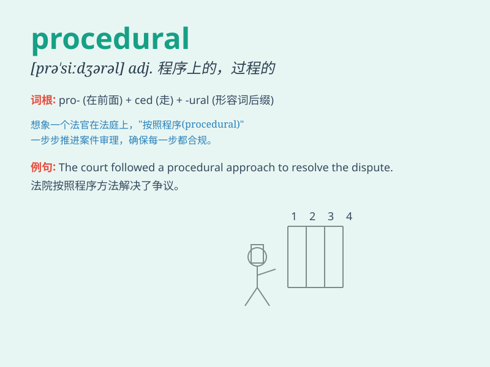

## procedural

**英音:** _[prə\'siːdʒərəl]_ **美音:** _[pro\'sidʒərəl]_

**译义:** *adj.程序上的*

### 短语

+ **procedural law:** _程序法_

+ **procedural fairness:** _程序公正_

+ **procedural knowledge:** _程序性知识_

+ **procedural due process:** _程序性正当程序_

+ **procedural step:** _程序步骤_

### 例句

#### 例句1

> **The company has strict procedural guidelines for handling
customer complaints.**

**中文翻译:** 这家公司在处理客户投诉方面有严格的程序指南。

**单词释义:** 程序上的；程序性的

#### 例句2

> **Procedural errors can lead to serious consequences in legal
cases.**

**中文翻译:** 程序错误在法律案件中可能导致严重后果。

**单词释义:** 程序的；流程的

#### 例句3

> **The new law aims to simplify the procedural aspects of business
registration.**

**中文翻译:** 新法律旨在简化企业注册的程序方面。

**单词释义:** 程序上的

### 背诵小故事

> A detective was solving a mystery. The process was full of procedural
steps. First, collecting evidence, then interviewing witnesses. Finally,
following the correct procedural rules, he caught the criminal.

**一位侦探在侦破一个谜团。这个过程充满了程序性的步骤。首先，收集证据，然后询问证人。最后，遵循正确的程序规则，他抓住了罪犯。**

### 图义

