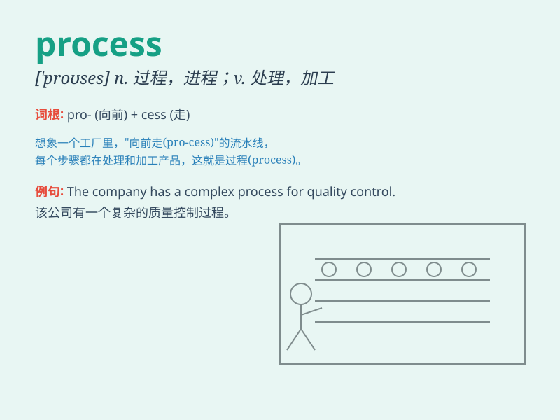

## process

**英音:** _[prəˈses;(for n.)ˈprəʊses]_ **美音:**
_[proˈsɛs;(for n.)prɑsɛs]_

**译义:** *n.过程,作用,方法,程序,步骤,进行,推移vt.加工,处理*

### 短语

+ **in the process of:** _在\...\...的过程中_

+ **business process:** _业务流程_

+ **manufacturing process:** _制造过程；制造工艺_

+ **thought process:** _思维过程_

+ **decision-making process:** _决策过程_

### 例句

#### 例句1

> **The factory uses a complex process to produce these goods.**

**中文翻译:** 这家工厂使用复杂的流程来生产这些商品。

**单词释义:** 流程；过程

#### 例句2

> **The data is being processed by the computer.**

**中文翻译:** 数据正在由计算机处理。

**单词释义:** 处理；加工

#### 例句3

> **The legal process can be very lengthy.**

**中文翻译:** 法律程序可能会非常冗长。

**单词释义:** 程序；步骤

### 背诵小故事

> A factory is like a big machine. Materials go in one end and products
come out the other. The steps in between are the \'process\'. Workers
carefully control each part of this process to make sure everything goes
smoothly.

**一家工厂就像一台大机器。材料从一端进去，产品从另一端出来。这中间的步骤就是"过程"。工人们仔细控制这个过程的每一部分，以确保一切顺利进行。**

### 图义

