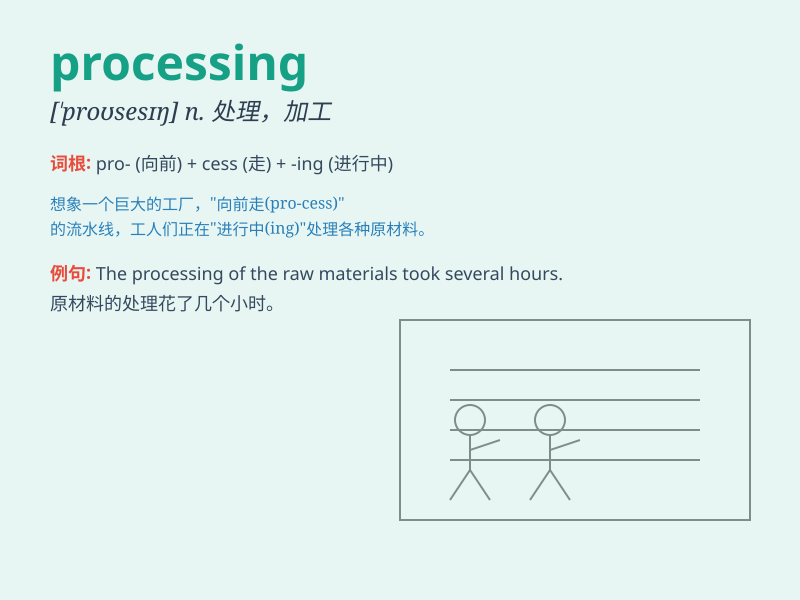

## processing

**英音:** _[prəˈsesɪŋ]_ **美音:** _[proˈsɛsɪŋ]_

**译义:** *处理*

### 短语

+ **data processing:** _数据处理_

+ **image processing:** _图像处理_

+ **signal processing:** _信号处理_

+ **processing speed:** _处理速度_

+ **processing plant:** _加工厂_

### 例句

#### 例句1

> **The data processing is taking longer than expected.**

**中文翻译:** 数据处理所花费的时间比预期的要长。

**单词释义:** 处理；加工

#### 例句2

> **We are in the processing of moving to a new office.**

**中文翻译:** 我们正在搬往新办公室的过程中。

**单词释义:** 过程；进程

#### 例句3

> **The food processing industry has strict hygiene standards.**

**中文翻译:** 食品加工业有严格的卫生标准。

**单词释义:** 加工（行业）

### 背诵小故事

> A factory was busy with processing materials. Workers were carefully
handling each step to turn raw materials into fine products. It was like
a magical transformation process, and \'processing\' was at the heart of
it all.

**一家工厂正忙于加工材料。工人们认真处理每一个步骤，将原材料变成优质产品。这就像一个神奇的转变过程，而\'processing\'就是其核心。**

### 图义

